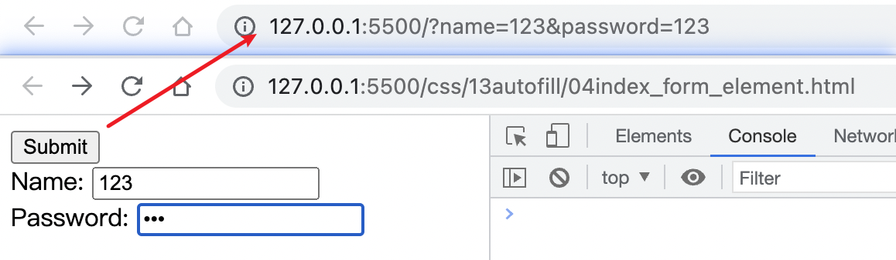
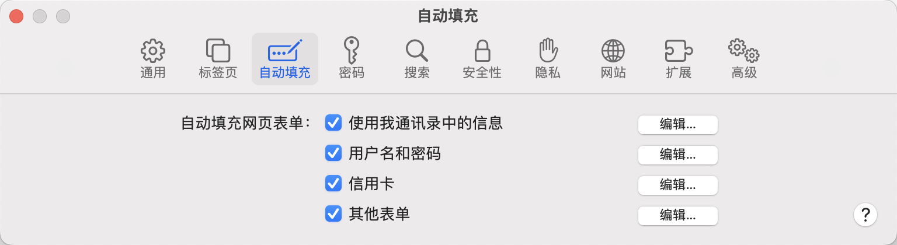
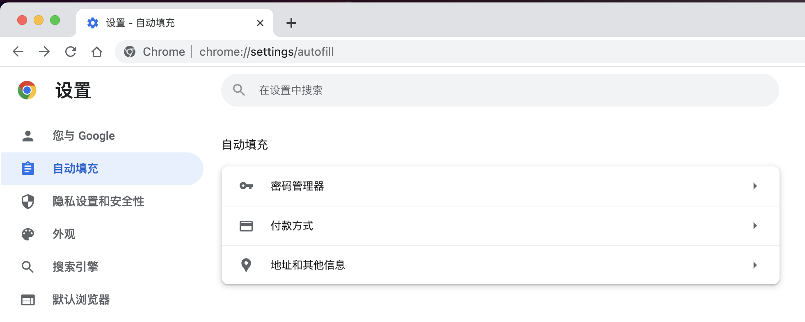
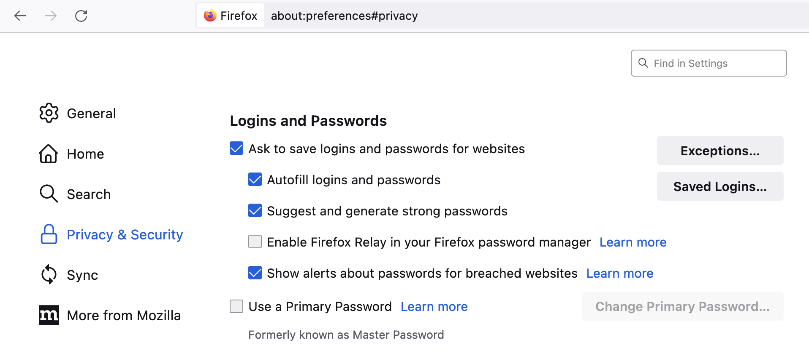
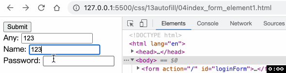
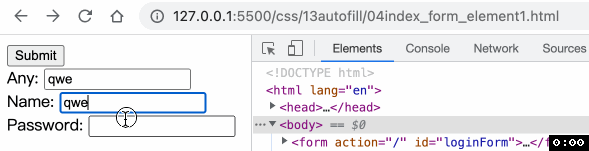

# HTML attribute autocomplete
`autocomplete` 让 `Web` 开发者指定浏览器必须提供什么权限才能自动协助填写表单字段, 以及给浏览器提供指导——填写信息的字段期望什么类型的信息.

`autocomplete` 适用于输入文本或数值的 `<input>` 元素, `<textarea>` 元素, `<select>` 元素和 `<form>` 元素.

自动填写的建议值来自浏览器. 通常都是用户之前输入过的值, 也有可能来自浏览器预先配置的值.

如果 `<input>`, `<textarea>`, 或者 `<select>` 没有 `autocomplete` 属性, 浏览器就会使用这些元素所在的 `<form>` 的 `autocomplete` 属性或者 `id` 属性与这些元素的 `form` 属性相同的 `<form>`.

上面这句话的意思就是 `form` 的表单元素可以不在 `form` 表单内! 如果想要将表单控件元素与表单关联起来, 只需要让控件的 `form` 属性与表单的 `id` 属性相同!
```html
<form action="/" id="loginForm">
  <button type="submit">Submit</button>
</form>
<div>
  <label for="name">Name: </label>
  <input form="loginForm" type="text" name="name" id="name">
</div>
<div>
  <label for="password">Password: </label>
  <input form="loginForm" type="password" name="password" id="password">
</div>
```
下图是具体的演示


📖为了提供自动完成的功能, 浏览器可能需要 `<input>`, `<textarea>` 或者 `<select>` 提供
- `name` 和/或 `id` 属性
- 拥有 `<form>` 祖先元素
- `<form>` 元素有 `type="submit"` 的 `<button>`

## 浏览器的不同策略
不同浏览器对于开启和关闭自动完成功能有自己的设定
- `Safari` 浏览器

- `Chrome` 浏览器

- `Firefox` 浏览器


## 值
- `off`
不允许浏览器自动输入或选择某字段的值. 📖在大多数现代浏览器中, 将 autocomplete 设置为 off 并不会阻止密码管理器询问用户是否要保存用户名和密码, 或者在自动登录的表单中自动填写这些值.
- `on`
允许浏览器自动完成. 如果某字段没有提供期待的类型, 那么浏览器会自己做出判断.
- `xxx`
`xxx` 可以有的值很多, 比如 `name`, `password`, `username` 等等, 具体可以参考 [MDN](https://developer.mozilla.org/en-US/docs/Web/HTML/Attributes/autocomplete) 中的介绍.

📖`autocomplete` 既可以添加在 `<form>` 元素上, 也可以添加在表单控件元素上. 添加在控件上还有一个额外的作用, 就是阻止浏览器在绘画历史记录中缓存表单数据. 当用户的表单数据缓存在 `session history` 中时, 用户点击了提交表单并返回🔙原表单页面的情况下, 会展示用户信息.

下图是默认行为

下图是只在 `name` 开启 `autocomplete` 为 `off` 的情况
```html
<input form="loginForm" type="text" name="name" id="name">
```


谢谢你看到这里😊