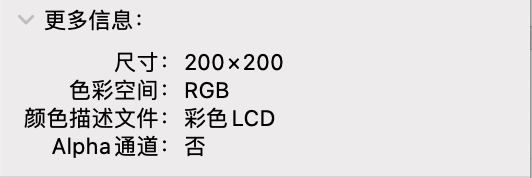
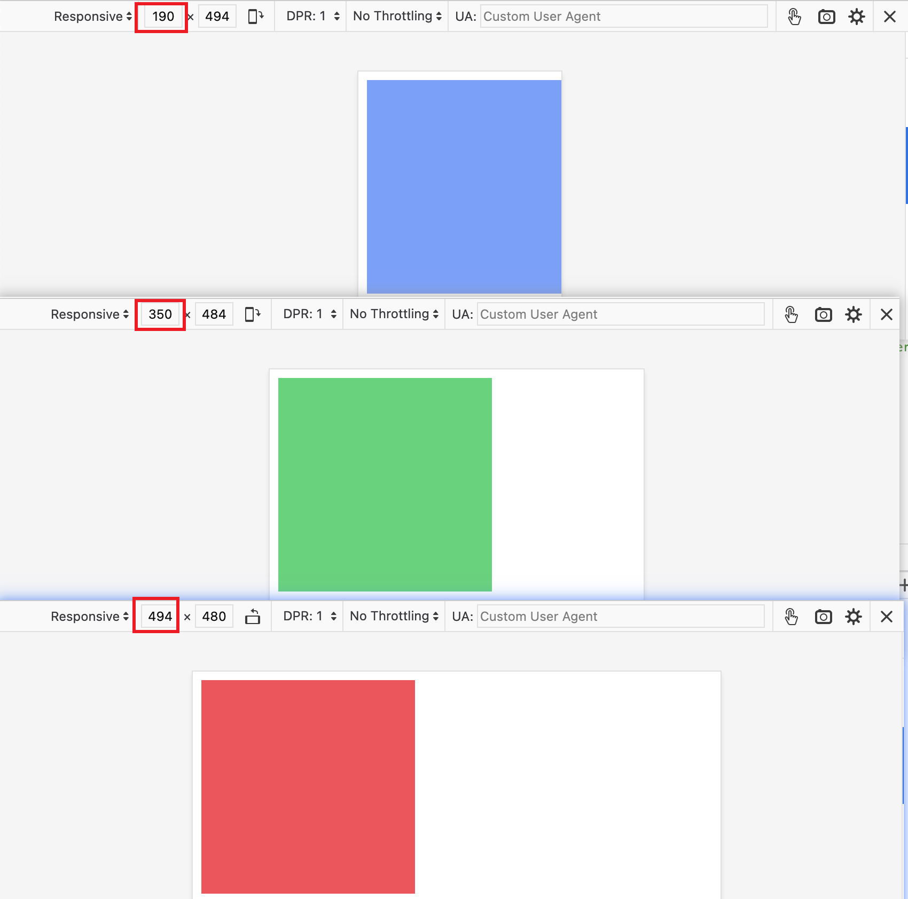

<!-- TOC -->

- [响应式图片](#%E5%93%8D%E5%BA%94%E5%BC%8F%E5%9B%BE%E7%89%87)
  - [前置知识](#%E5%89%8D%E7%BD%AE%E7%9F%A5%E8%AF%86)
    - [art direction problem](#art-direction-problem)
    - [光栅图像与矢量图像 raster image and vector images](#%E5%85%89%E6%A0%85%E5%9B%BE%E5%83%8F%E4%B8%8E%E7%9F%A2%E9%87%8F%E5%9B%BE%E5%83%8F-raster-image-and-vector-images)
  - [ 能否担此重任](#img-%E8%83%BD%E5%90%A6%E6%8B%85%E6%AD%A4%E9%87%8D%E4%BB%BB)
    - [sizes](#sizes)
    - [srcset](#srcset)
    - [实际看一看](#%E5%AE%9E%E9%99%85%E7%9C%8B%E4%B8%80%E7%9C%8B)
  - [<picture>:  的好姐妹](#picture-img-%E7%9A%84%E5%A5%BD%E5%A7%90%E5%A6%B9)
  - [其他注意事项](#%E5%85%B6%E4%BB%96%E6%B3%A8%E6%84%8F%E4%BA%8B%E9%A1%B9)

<!-- /TOC -->

# 响应式图片
图片在网页中占据了 [超过 60%](https://web.dev/responsive-images/#relative_sized_images) 的浏览带宽, 因此在移动设备显示图片或者显示小图时没有必要请求原图或高清图, 同样, 在高分辨率屏幕的设备请求低分辨率的图片也不合适, 因此如何请求图片就有一些门道值得探索!

## 前置知识
### art direction problem
上面提到了在移动设备(或窄屏幕)上显示图像时可以请求低分辨率图, 或者使用裁剪过的图片以便图片的主要信息可以显示出来, 比如将图片中的人物裁剪出来. 另外在更宽一些的屏幕, 比如平板或折叠屏上请求第二个裁剪图片. 在更宽的屏幕, 比如笔记本(laptop)或者大型显示器(desktop)请求完整图像. 这种根据设备特性显示不同图像的问题就叫做 [art direction problem, 艺术指导问题](https://developer.mozilla.org/en-US/docs/Learn/HTML/Multimedia_and_embedding/Responsive_images).

### 光栅图像与矢量图像 raster image and vector images
[光栅图像](https://developer.mozilla.org/en-US/docs/Glossary/Raster_image)是定义为像素网格的图片文件, 也称为**位图**, 常见的光栅图像有 PNG, JPEG, GIF 和 ICO. 光栅图像通常有固定大小的尺寸, 即宽有多少像素, 高有多少像素.

[矢量图像](https://developer.mozilla.org/en-US/docs/Learn/HTML/Multimedia_and_embedding/Adding_vector_graphics_to_the_Web)是由算法定义的, 矢量图像包含形状(shape)和路径(path)定义, 计算机可以使用这些定义来计算出图像在屏幕上应该如何显示. 如此, 矢量图即便放大或缩小, 也不会像光栅图像变得模糊或像素化.

虽然矢量图有缩放的优势, 但是它只适合非常简单的图形、图案, 一旦矢量图需要包涵很多细节, 它就会变得非常复杂.
## `` 能否担此重任
### sizes
这个属性的值是用英文逗号分开的多个字符串, 用来指定一系列大小, 其中每个大小包含
- `一个媒体查询条件`: 媒体查询条件描述的视口(viewpoint)的属性, 而不是图片的属性. 最后一个字符串**不可以**有这个值
- `一个表达大小的值`: 

一个合法的 sizes 的值可以是
- `(max-width: 800px) 500px, 50vw`

这个值表示在媒体查询条件成立时用来展示图片的大小. 比如 `(max-width: 800px) 500px` 表示如果屏幕宽度小于等于 800px 时, 用来展示图片的宽度应该是 500px. 有了 500px, 浏览器就会从 srcset 中找到最匹配的使用宽度描述符的图片. 如果没有 srcset 或者 srcset 提供的值不包含宽度描述符, 那么 sizes 属性不会生效.

### srcset
`` 有一个必选的 src 属性, 当然也有一个非必选的 srcset 属性. 这个属性的值是用英文逗号分开的字符串, 用来指定浏览器可以使用的图像, 其中每个字符串都由以下部分组成
- 图像的 `URL`
- 一个空格
- 描述符(以下之一)
  - 宽度描述符(正整数+w), 比如 `480w`, 其中 w 就表示像素宽度(width), 但不可以使用 px 哦😯. 宽度描述符除以 sizes 属性中给出的大小来计算有效像素密度. 📖这里的宽度指的是图片的宽度, 我们可以在操作系统上查看图片的大小.
    - 
  - 像素密度描述符(正浮点数+x), 比如 `1.5x`
  - 如果没有指定描述符, 那么默认值为 `1x`

所以, srcset 的合法值可以是
- `red.jpeg 480w`
- `red.jpeg 480w, blue.jpeg 640w`

当然, 在一个 srcset 属性中不可以同时使用宽度描述符和像素密度描述符, 比如 `red.jpeg 480w, blue.jpeg 2x`❌, 同样的, 如果图像的描述符完全相同也不行, 比如 `red.jpeg 2x, blue.jpeg 2x`❌

如果 srcset 使用了宽度描述符, 那么 `` 必须提供 sizes 属性, 否则 srcset 自身会被忽略.

### 实际看一看
浏览器是如何根据 sizes 和 srcset 做出选择的呢?
1. 查看设备宽度
2. 找出 sizes 中第一个为 true 的媒体查询条件并获得设置的大小值, 比如 W
3. 加载 srcset 中宽度和 W 相同的图片大小, 如果没有, 那么加载一个大于 W 的图片大小. 

来看代码
```html

```
见下图, 和我们想象中的一模一样. 当 viewpoint 宽度小于 200px 时匹配展示的是蓝色图片; 当 viewpoint 宽度在 200px-400px 时展示的是绿色图片; 当 viewpoint 宽度在 400px-800px 时展示红色图片


这里有两点需要特别说明

1️⃣ 我在 Chrome 测试时表现和预期并不一样, 直到我切换 Firefox 并且选择 (物理像素/逻辑像素) 为 1, 才可以看到预期结果. 后来我在 Chrome 找到了设置 DPR 的地方. 但是如果你在开发者工具中手动拖拽改变 viewpoint 宽度也没有效果, 你必须先手动切换到某一宽度, 然后刷新页面, 才可以看到预期效果, 但是 Firefox 就不是这样, Firefox 中的效果预览是实时的. 
2️⃣ 实际上这三个图片的大小是一样的, 都是 200*200, 但是我们在 srcset 中的宽度可以不同于实际宽度从而来达到选择图片的目的哦~

## `<picture>`: `` 的好姐妹 

## 其他注意事项
在使用图片时常遇到的一个问题, 就是图片会超过父容器的宽度, 好巧不巧的是 CSS 中 overflow 的默认值是 visible, 就导致图像溢出, 因此可以考虑给所有的 `` 或者 `<video>` 等元素设置最大宽度 (当然, `` 的默认 display 是 inline, 但是一般的组件库或者 CSS 库都会修改 `` 的 display 为 block 或者 inline-block)
```css
img, video {
  max-width: 100%;
}
```
<hr />
除此之外, 我们还需要为 `` 的非必需 alt 属性提供有意义的描述, 这样做的目的是提高网页的可访问性. 通常屏幕阅读器或者其他辅助技术会读取 alt 的值以告诉用户图片展示了什么内容. 另外如果图片因为网络等其他原因无法加载时页面会展示 alt 的内容.


谢谢你看到这里😊