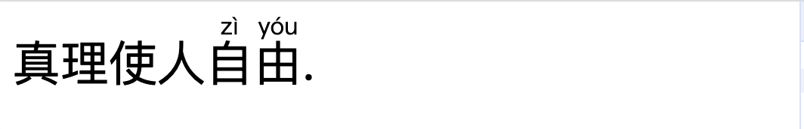
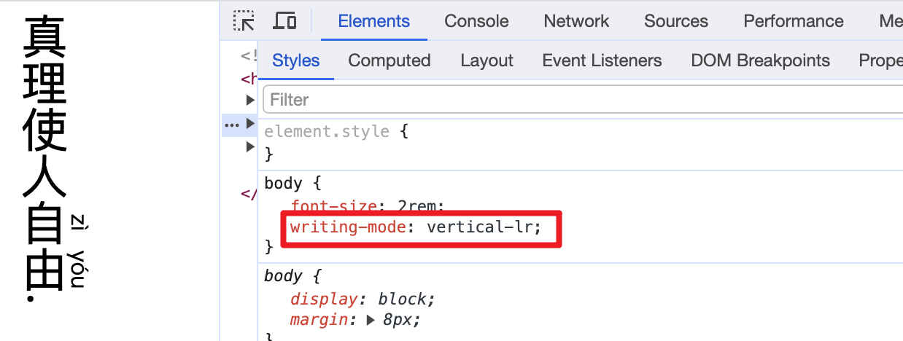
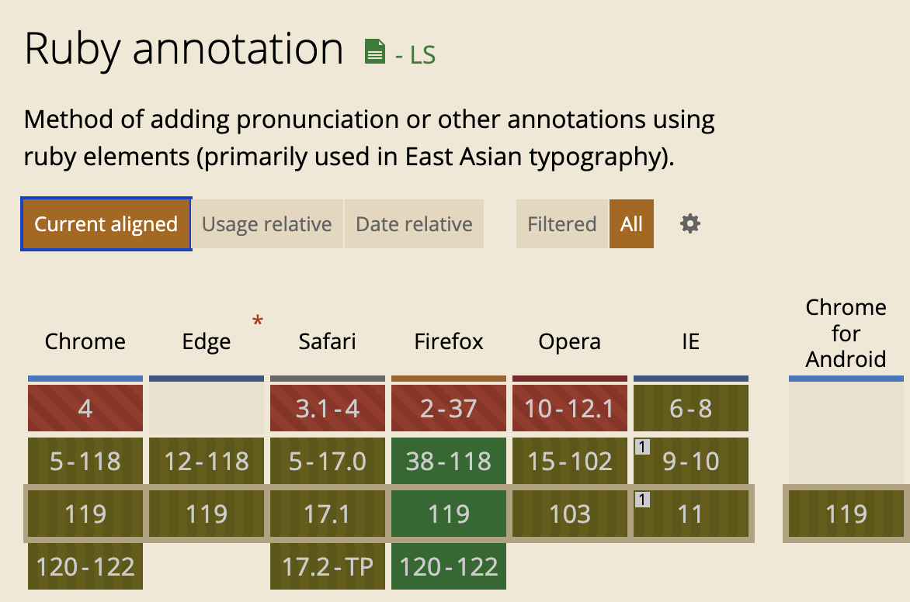

<!-- TOC -->

- [使用 ruby 给汉字加拼音](#%E4%BD%BF%E7%94%A8-ruby-%E7%BB%99%E6%B1%89%E5%AD%97%E5%8A%A0%E6%8B%BC%E9%9F%B3)
  - [<ruby>](#ruby)
  - [<rp>](#rp)
  - [<rt>](#rt)
  - [兼容性](#%E5%85%BC%E5%AE%B9%E6%80%A7)

<!-- /TOC -->

# 使用 ruby 给汉字加拼音
大家有没有遇到过要给汉字头顶上加拼音的需求? 如果有的话, 你是怎么解决的呢? 如果费尽心思, 那么你可能走了很多弯路, 因为 HTML 原生就有这样的标签来帮我们实现类似的需求.

## `<ruby>`
> ruby 本身是「红宝石」的意思, 与题无关

`<ruby>` 元素是可以渲染在基本文字上、下或旁边的小注释, 通常用来显示东亚文字(CJK, Chinese Japanese and Korean)的发音.

先一睹为快效果
```html
<body>
  真理使人
  <ruby> 自 <rp>(</rp><rt>zì</rt><rp>)</rp> </ruby>
  <ruby> 由 <rp>(</rp><rt>yóu</rt><rp>)</rp> </ruby>
  .
</body>
```


哇😍, 效果是不是很赞! 没错, 使用起来就是折磨简单, 不过除了 `<ruby>` 外, 我们还用到了很多其他元素, 下面就一一来介绍

这里多说一句, 即便是不同的书写方向, `<ruby>` 仍然可以很好的适应. 比如我们将书写顺序改为垂直书写.



## `<rp>`
> The Ruby Fallback Parenthesis element, Parenthesis 是圆括号的意思

`<rp>` 元素用来为不支持 `<ruby>` 显示的浏览器提供兜底的括号.

每一组 `<rp></rp>` 应该分别将开始和结束圆括号括起来, 这对圆括号再将 `<rt>` 元素括起来, 而最终拼音是在 `<rt>` 元素中.

```html
<rp>(</rp><rt>zì</rt><rp>)</rp>
```

## `<rt>`
> The Ruby Text element

在 `<rt>` 中提供东亚文字的发音等信息, `<rt>` 必须包含在 `<ruby>` 中.

## 兼容性
桌面浏览器没得说, 如果需要适配手机端, 还需要多多考虑




谢谢你看到这里😊