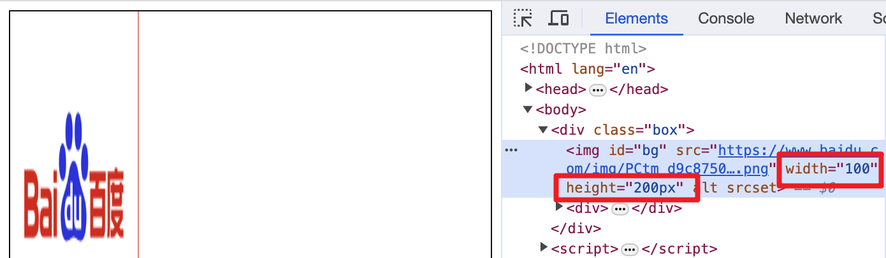
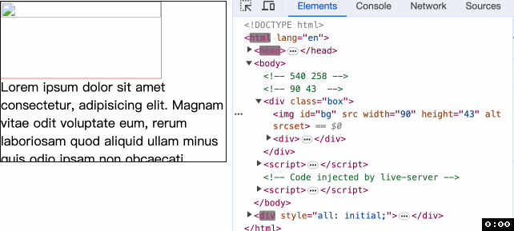
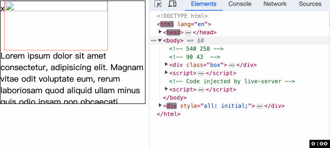
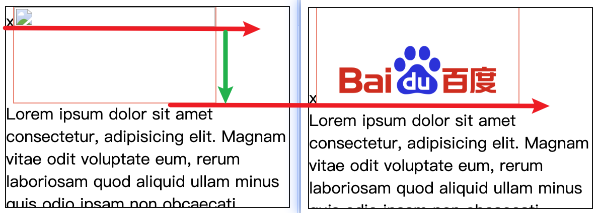
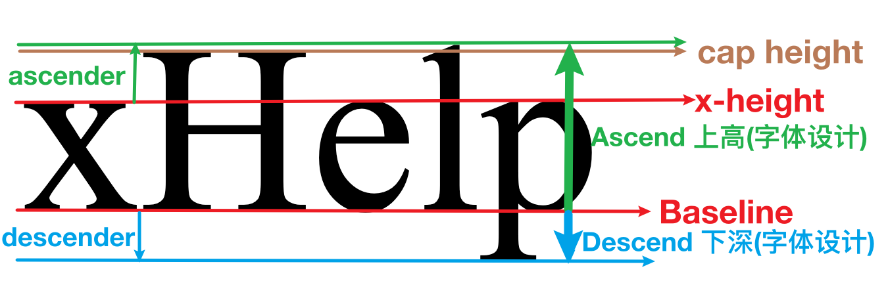
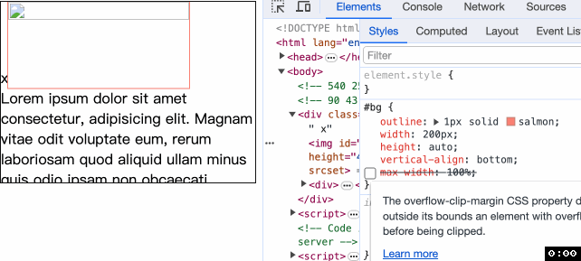

# `image` 标签的 `width` 和 `height` 有大作用!!!
我们将在这里探讨一个问题, 如果在加载图片之后不影响图片下边文字的移动.

在给出答案之前, 要知道 `width` 在 2019 年之后 [有了更多能力](https://caniuse.com/mdn-html_elements_img_aspect_ratio_computed_from_attributes). 也就是浏览器会根据 `width` 和 `height` 计算 `aspect-ratio`. 当然, 为了实现我们的目标, 提前知道图片的宽高比是必须的.

感谢百度, 因为我用了百度的 `logo` 图片作为展示. 图片的大小是 `540*258`


## `width` 最开始的用途
`width` 和 `height` 用来指定图片的宽度和高度, 虽然要求值都是以 `px` 为单位的数字, 但是下图中带单位的写法写生效


作为标签属性的 `width` 是可以被 `CSS` 中的 `width` 覆盖的.


## 发挥作用
下面我们需要开始处理. 将 540 和 258 分别除以 6 得到 90 和 43.
```html
<div class="box">
  
  <div>Lorem...</div>
</div>
```
```css
#bg {
  width: 200px;
  height: auto;
  outline: 1px solid salmon;
}
```
在 3s 后才加载图片
```js
const bg = document.getElementById('bg')
setTimeout(() => {
  bg.src = 'https://www.baidu.com/img/PCtm_d9c8750bed0b3c7d089fa7d55720d6cf.png'
}, 3000)
```
来看效果


感觉不错, 但是文字还是发生了一些抖动, 分析后我发现可能是图片对齐问题, 为了验证我的想法, 我在图片前面加上了一个字母 `x`
```html
<div class="box">
  x
  <div>Lorem...</div>
</div>
```


我们知道 `x` 下边缘就是行盒子 `baseline` 的位置. `x` 的位置变动就表示行高发生了变化. 而图片的下边缘是在 `baseline`, 所以图片抖动的原因就是 `baseline` 发生了偏移.



当 `baseline` 下移后, `descender` 的距离就是文字抖动的距离.


为了阻止文字移动, 我们要阻止 `baseline` 的移动, 或者我们通过指定图片的 `vertical-align` 为 `bottom` 也可以达到相同的效果.



哈哈哈我们完成了最开始设置的目标. 喝杯奶茶🥤庆祝一下吧~ 谢谢你看到这里😊