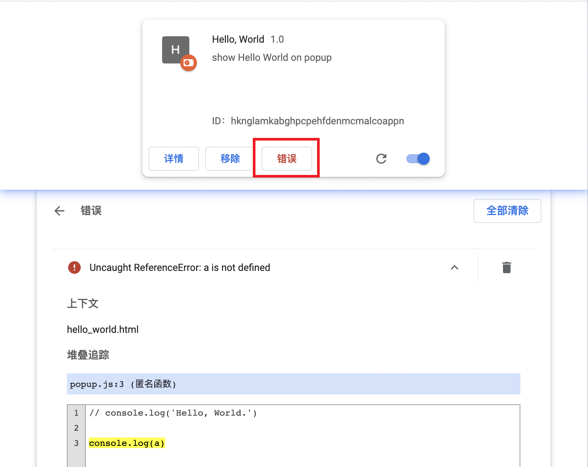

<!-- TOC -->

- [开发 Chrome 扩展](#%E5%BC%80%E5%8F%91-chrome-%E6%89%A9%E5%B1%95)
  - [Hello, World](#hello-world)
    - [项目](#%E9%A1%B9%E7%9B%AE)
    - [加载未打包的扩展](#%E5%8A%A0%E8%BD%BD%E6%9C%AA%E6%89%93%E5%8C%85%E7%9A%84%E6%89%A9%E5%B1%95)
    - [icon](#icon)
    - [刷新](#%E5%88%B7%E6%96%B0)
    - [引入 JS 与错误处理](#%E5%BC%95%E5%85%A5-js-%E4%B8%8E%E9%94%99%E8%AF%AF%E5%A4%84%E7%90%86)
  - [更复杂一点的的扩展](#%E6%9B%B4%E5%A4%8D%E6%9D%82%E4%B8%80%E7%82%B9%E7%9A%84%E7%9A%84%E6%89%A9%E5%B1%95)
    - [声明 content script](#%E5%A3%B0%E6%98%8E-content-script)
    - [match patterns](#match-patterns)

<!-- /TOC -->

# 开发 Chrome 扩展
开发 `Chrome` 扩展除了需要基本的 `HTML`, `CSS`, `JS` 之外, 还可以使用 `Chrome` [额外提供的 API](https://developer.chrome.com/docs/extensions/reference/).

除了需要的 `.html`, `.css` 和 `.js` 文件之外呢, 扩展还包括不同类型的文件, 具体可以包含哪些文件取决于扩展提供的功能. 下面列出最经常用到的文件
- `The manifest`

每个扩展都**必须**提供一个名为 `manifest.json` 的文件, 而且这个文件必须位于扩展的根目录. `manifest.json` 通常提供了重要的元数据, 资源定义, 权限许可, 并且指明哪些文件在后台运行, 哪些在页面运行.
- `The service worker`

插件的 `service worker` 用来监听和处理浏览器事件, 包括导航🧭到新页面、移除书签🔖或者关闭一个页面等. `service worker` 可以使用所有的 `Chrome APIs` 但是它不能直接与页面的内容交互

- `content scripts`

`content scripts` 才在网页的环境中执行 `JS`. 它们可以读取和修改扩展注入的页面的 `DOM`. `content scripts` 只能使用一部分 `Chrome APIs` 但是可以与 `service worker` 交换信息来简洁访问剩下的 `APIs`.

- `The popup and other pages`

扩展可以包括各式各样的 HTML 文件, 比如弹出页面, 选项页面和其他页面. 所有页面都可以访问 `Chrome APIs`

## `Hello, World`
### 项目
下面写一个 `Hello World` 版本的插件, 插件的功能就是创建点击插件时展示 `Hello World` 和当前时间.

创建一个文件夹, 并创建 `manifest.json`.
```json
{
  "manifest_version": 3,
  "name": "Hello, World",
  "description": "show Hello World on popup",
  "version": "1.0",
  "action": {
    "default_popup": "hello_world.html",
    "default_icon": "favicon-16x16.png"
  }
}
```
这个文件必须包含的 `key` 是 `manifest_version`, `name` 和 `version`. 开发阶段支持 `//` 形式的注释, 如果要上架到 `Chrome Web Store` 必须移除注释.

使用 [https://favicon.io/](https://favicon.io/) 创建扩展的图标. 然后创建 `hello_world.html`
```html
<html>
  <style>
    h3 {
      color: #ff5e57;
    }
  </style>
  <body>
    <h3>Hello World</h3>
  </body>
</html>
```

### 加载未打包的扩展
在开发者模式下加载未打包的扩展
1️⃣在 `Chrome` 浏览器中输入 `chrome://extensions/` 进入扩展管理页面. 点击右上角开关打开开发者模式


点击「加载已解压的扩展程序」并选择开发插件代码的文件夹


然后选择浏览器右上角的扩展按钮🔘,并将自己的开发的扩展固定在导航栏部分. 之后点击我们的插件就可以看到效果了


### icon
其实发现了上面的截图中, 扩展页面是没有图片的. 在 `manifest.json` 中通过 `icons` 声明
```json
{
  ...
  "icons": {
    "16": "favicon-16x16.png",
    "32": "favicon-32x32.png",
    "48": "android-chrome-192x192.png",
    "128": "android-chrome-512x512.png"
  }
}
```
不同大小的 `icon` 用在不同的地方展示
- `16x16`: 用在浏览器右上角的扩展和扩展按钮点击后的展示
- `32x32`: `windows` 操作系统要求 `32x32` 大小
- `48x48`: 在扩展管理页面
- `128x128`: 安装时展示, 在 `Chrome Web Store` 中展示

### 刷新
如果我们修改了代码, 可以在扩展管理页面点击右下角的刷新按钮刷新
```html
<html>
  <style>
    body {
      min-width: 300px;
    }
    h3 {
      color: #ff5e57;
    }
  </style>
  <body>
    <h3>Hello World</h3>
  </body>
</html>
```

当然, 不是所有文件修改后都需要刷新, 只有 `manifest.json`, `service worker`, `content scripts` 修改了才需要刷新.    

### 引入 JS 与错误处理
我们可以创建 `popup.js` 并在 `hello_world.html` 中引入
```js
console.log('Hello, World.')
```
```html
<body>
  <h3>Hello World</h3>
  <script src="./popup.js"></script>
</body>
```
为了看到打印的内容, 需要完成下面的操作
- 点击扩展的刷新按钮
- 点击扩展, 弹出页面
- 右击页面, 出现菜单并选择「检查」项
- 在弹出的扩展的开发者工具中, 选择 `console` 选项卡, 就可以看到输入的内容了😊


如果 `JS` 中出现了错误, 例如打印一个不存在的变量, 然后重复上面刷新的步骤
```js
console.log(a)
```
之后, 在扩展管理页面扩展就出现了「错误」按钮, 点击就可以看到具体的错误代码和错误原因.


## 更复杂一点的的扩展
### 声明 `content script`
扩展可以运行脚本来读取和修改页面的内容, 这些脚本就叫做**内容脚本`(content script)`**. 内容脚本运行在一个「隔离」的环境中, 不会与主页面或其他扩展的内容脚本冲突. 通过在 
`manifest.json` 中注册内容脚本.

在根目录下创建 `scripts` 文件夹, 继而创建 `content.js`
```json
{
  ...
  "content_scripts": [
    {
      "js": ["scripts/content.js"],
      "matches": [
        "https://developer.chrome.com/docs/extensions/*",
        "https://developer.chrome.com/docs/webstore/*"
      ]
    }
  ]
}
```
### match patterns
上面出现了 `matches`, 它可以有一个或多个`匹配模式(match patterns)`. 匹配模式允许浏览器识别到当前内容脚本注入的是哪些网站. 匹配模式可以包括三部分
> `<scheme>://<host><path>`


```js
```
```html
```


