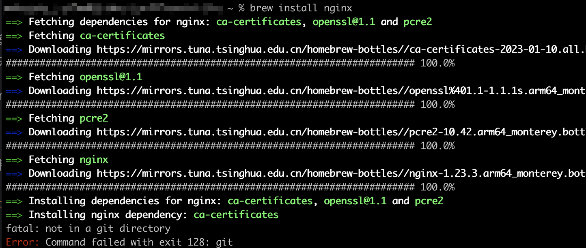
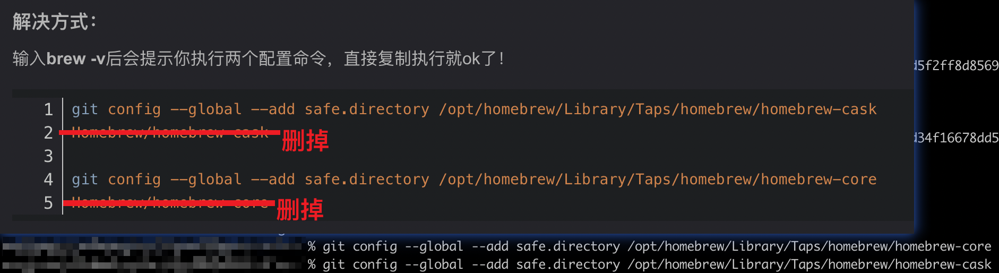
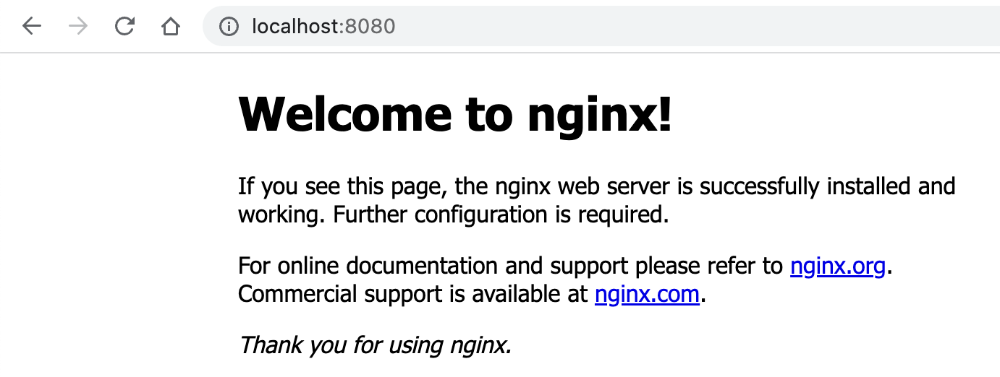

# 在 M1 Mac 上安装 Homebrew 和 nginx
> `Homebrew` 是 `macOS` 上包管理工具, 比如可以用 `Homebrew` 安装 `nginx`

1️⃣ 按照 [这个教程](https://www.jianshu.com/p/fdf7e316f096) 安装. 安装过程中会提示选择国内镜像和开机密码之类的, 按照要求做就行.

安装成功后, 重启 `shell`. 

2️⃣ 按照 [这个教程](https://segmentfault.com/a/1190000016020328) 安装 `nginx`. 

安装过程中会出现下面的报错



然后按照 [这个教程](https://blog.csdn.net/qq_25404477/article/details/126102189) 解决报错. 在复制教程中命令的时候注意教程中给出的命令有些多余的字符, 删掉不要



最后安装成功, 运行 `nginx` 命令, 并访问 [http://localhost:8080/](http://localhost:8080/). 📖注意 `8080` 端口是否被占用.



一些 `nginx` 的命令
```js
nginx // 启动
nginx -s reload // 重启
nginx -s stop // 停止
```
谢谢你看到这里😊
