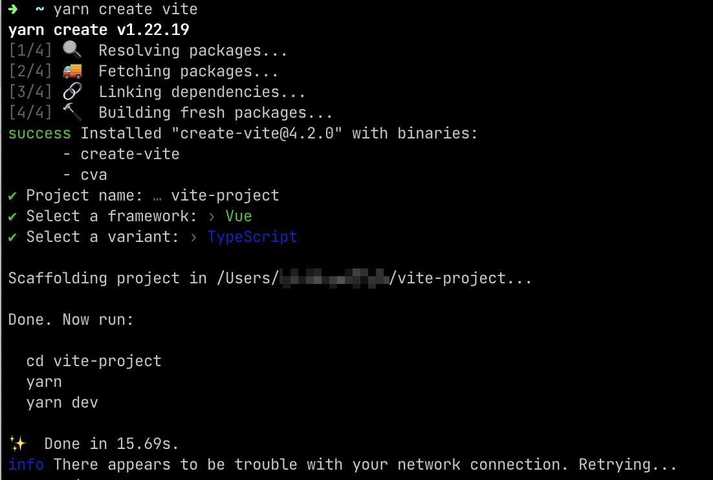
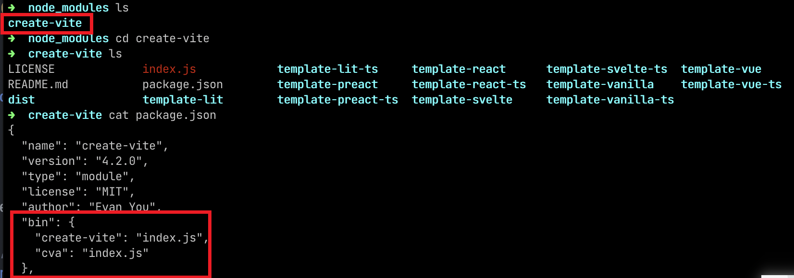

# Node & NPM & yarn 常用命令总结

## Node
1. 查看 node 版本
    - `node -v`
    - 

## NPM

## yarn
### `yarn create xxx [参数]`
这个命令的意思是从任何` create-xxx` 工具包创建新项目. 这是一个简写命令, 同时做两件事情
- 全局安装 `create-xxx`(没错, 就是将 `create` 和后面的 `xxx` 用连字符连在一起😂), 如果已经存在则会更新到最新版本
- 运行工具包的 `package.json` 中的 `bin` 字段的可执行文件, 并传递命令中 `[参数]`

下面就是运行 `yarn create vite` 的执行结果

我们就在 `yarn` 的全局安装目录下找到了 `create-vite`, 并看到了这个项目的 `package.json` 中的 `bin` 字段指向的可以执行的文件 `index.js`

### `yarn global`
> 与 yarn 全局有关的命令
- `yarn global add xxx`: 全局安装包 xxx

谢谢你看到这里😊

