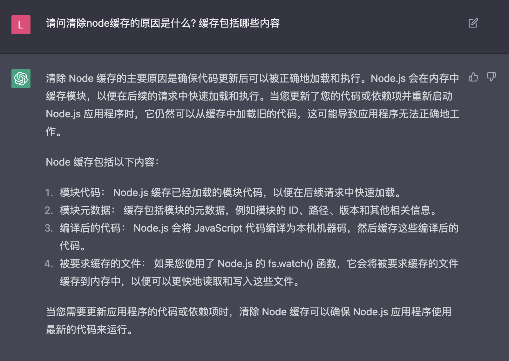
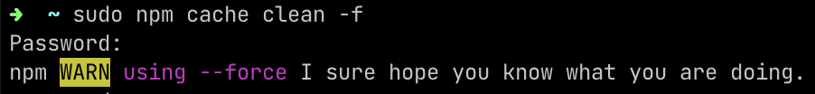
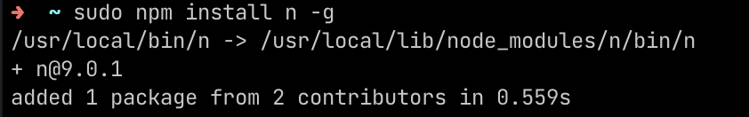
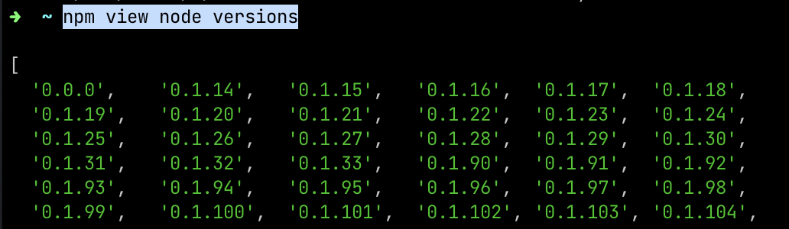
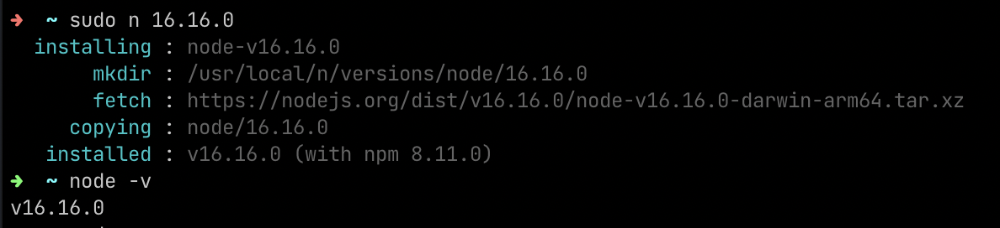
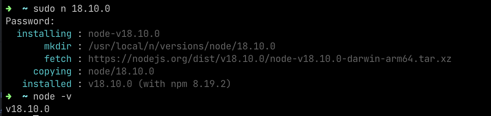
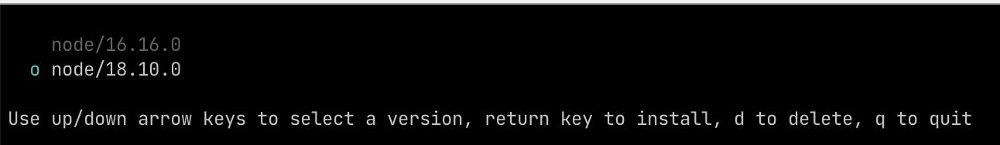
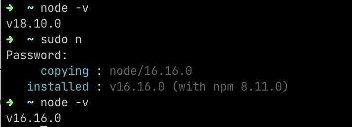

# Mac 使用 n 进行 Node 版本管理
首先介绍一下 [n](https://www.npmjs.com/package/n) 是 Node.js 的版本管理工具

在使用 `n` 进行版本管理之前, 我们需要强制清理 `Node` 的缓存. 为什么需要清除缓存以及缓存都包含哪些内容, 我们来看一下选手 `ChatGPT` 的回答😁


1. 执行清理缓存的命令(📖: 如果命令报错, 请在命令前加上 `sudo` 来获取最高权限, 下同)
```
npm cache clean -f
```


2. 全局安装 `n`
```
npm install n -g
```


使用 `n -V` 查看使用安装成功


下面就是使用 `n` 的方式了, 首先查看所有 `Node` 的版本
```
npm view node versions
```
版本太多了, 只截取了部分


我最开始的 `Node` 是在官网下载安装的, 所以如果我要使用 `n` 进行版本管理, 我就需要使用 `n` 下载安装 `Node`. `n <version>` 下载指定版本的 `Node`, 之后使用 `node -v` 验证
```
sudo n 16.16.0
```


接下来, 我们再安装一下 `18` 版本的 `Node`
```
sudo n 18.10.0
```


好了, 有了两个版本, 才真正满足了版本管理的条件, 接下来可以只使用命令 `n` 来查看本地已安装的 `Node` 所有版本. 使用上下键控制选择, `q` 退出, `d` 删除, 回车使用对应的版本.

然后我们就从 `18` 切回到 `16` 版本了. (📖: 如果切换失败, 记得加上 `sudo` 哦)


谢谢你看到这里😊
