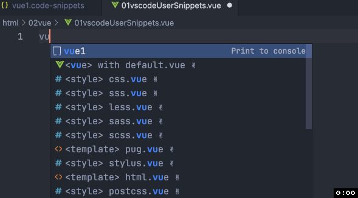
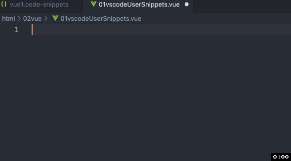

# 在 VS Code 的 User Snippets 中使用美元符号 $ 失败的问题
在日常工作里经常会用到一些常用的代码片段, 比如创建一个 `.vue` 文件的初始结构, 所以我会选择在 `VS Code` 的 `User Snippet` 中创建一个代码片段, 如下
```json
{
	"Print to console": {
		"scope": "vue",
		"prefix": "vue1",
		"body": [
			"<template></template>",
			"<script>",
			"export default {",
			"  mounted() {",
			"   this.$forceUpdate()",
			"  }",
			"}",
			"</script>"
		],
		"description": "Log output to console"
	}
}
```


可以发现, 我们代码中的 `$` 不见了, 这是因为在 `User Snippet` 中 `$` 加数字被用来作为后续自定义输入的位置, 所以如果我们想要保留 `$`, 就必须转义, 使用 `\\$`
```json
{
	"Print to console": {
		"scope": "vue",
		"prefix": "vue1",
		"body": [
			"<template></template>",
			"<script>",
			"export default {",
			"  mounted() {",
			"   this.\\$forceUpdate()",
			"  }",
			"}",
			"</script>"
		],
		"description": "Log output to console"
	}
}
```



哈哈, 完成了, 谢谢你看到这里😊
