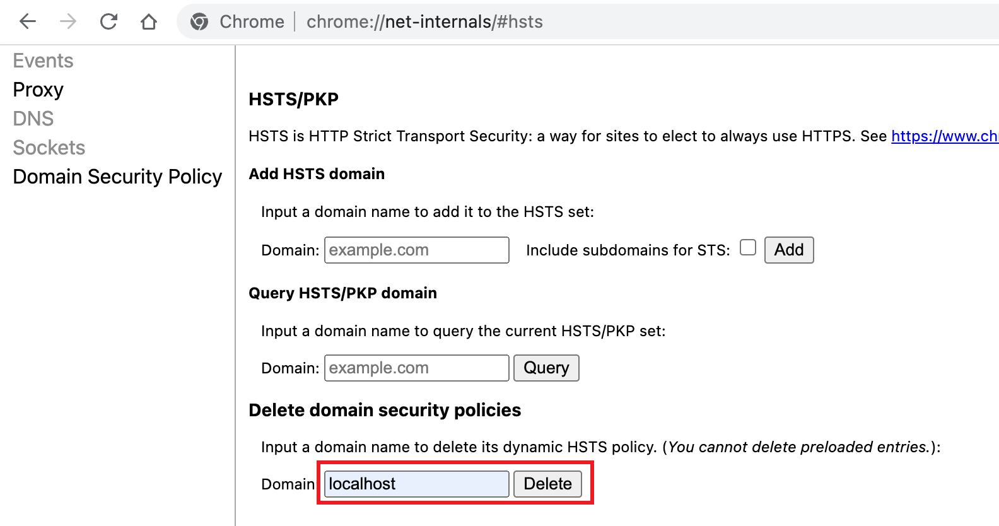

<!-- TOC -->

- [Vue localhost 从 http 307 到 https](#vue-localhost-%E4%BB%8E-http-307-%E5%88%B0-https)
  - [HTTP 307 与 HSTS](#http-307-%E4%B8%8E-hsts)
    - [HTTP 307](#http-307)
    - [中间人攻击](#%E4%B8%AD%E9%97%B4%E4%BA%BA%E6%94%BB%E5%87%BB)
    - [HSTS - HTTP Strict Transport Security](#hsts---http-strict-transport-security)
  - [如何解决问题](#%E5%A6%82%E4%BD%95%E8%A7%A3%E5%86%B3%E9%97%AE%E9%A2%98)

<!-- /TOC -->

# Vue localhost 从 http 307 到 https
最近在工作上遇到一个问题, 一个 `Vue2` 项目之前本地都是通过 `HTTP` 的 `localhost` 访问(如下) 后来突然无法访问了, 提示的错误内容是 `ERR_SSL_PROTOCOL_ERROR`

我打开开发工具的 `Network` 一看, 本来好好的 `HTTP` 被 `307` 到了 `HTTPS`. 为啥会出现这种情况呢?

因为我本地的另一个 `localhost` 开启了 `HTTPS` 而且使用了 [HSTS](https://weblog.west-wind.com/posts/2022/Oct/24/Fix-automatic-rerouting-of-http-to-https-on-localhost-in-Web-Browsers#why-is-this-happening-hsts). 

(🤫: 如果你看到最后再回到这儿, 其实可以手动把 `localhost` 加入到浏览器对 `HSTS` 的维护达到同样效果的)

## HTTP 307 与 HSTS
### HTTP 307
`HTTP` 状态码是服务器对浏览器的响应. 每个状态码都是一个三位数字, 其中第一位数字定义了响应的类型. `3xx` 表示重定向, 即浏览器会重定向到一个新的 `URL`, 并且这个 `URL` 是 `HTTP` 响应头 `Location` 的值. 如上图

[307](https://kinsta.com/knowledgebase/307-redirect/) 代表的是临时重定向状态码, 与 `302` 和 `303` 不同的是, `307` 不允许重定向修改请求方法(比如从 `POST` 修改为 `GET`), 相对来说就更加严格.

### 中间人攻击
为什么直接重定向就可以了, 还半路杀出来个 `HSTS` 呢? `HSTS` 解决了哪些重定向不能解决的问题呢? [中间人攻击 man-in-the-middle attack](https://www.troyhunt.com/the-beginners-guide-to-breaking-website/).

假设你连上了咖啡店的公共 `WiFi`, 然后访问你的网上银行账户, 并且是通过 `HTTP` 访问网站的, 那么中间人就可以拦截你的 `HTTP` 请求并重定向到一个和你要去的网站界面一模一样并且连网站地址都很相似的假网站, 如果你不认真观察就输入账号和密码, 那么你的信息就会被中间人窃取.

### HSTS - (HTTP Strict Transport Security)
如果一个网站运行于 `HTTPS` 之上, 那么 `HSTS` 强迫浏览器使用安全连接, 任何通过使用 `HTTP` 访问网站的尝试都将被强制转换为 `HTTPS`. 实际上, [Strict-Transport-Security](https://developer.mozilla.org/en-US/docs/Web/HTTP/Headers/Strict-Transport-Security) 就是一个响应头.

大家可以尝试通过 `HTTP` 访问这个百度 [
http://www.baidu.com/](
http://www.baidu.com/), 然后看到页面被重定向到 `HTTPS`.

那么 `HSTS` 是如何解决中间人攻击的问题呢? 只要你使用 `HTTPS` 访问你的网站(比如网上银行)一次并且该网站使用 `HSTS`, 那么浏览器将会自动并且仅仅使用 `HTTPS` 访问你的网站.

响应头 `Strict-Transport-Security` 的值可以包含 `max-age=<expire-time>`, 表示过期时间, 即在过期时间内对该网站的所有请求都必须使用 `HTTPS`. 如果之后的请求继续返回 `Strict-Transport-Security` 响应头, 那么浏览器将会更新过期时间. 过期时间之后, 可以通过 HTTP 访问网站了.

一个问题? 虽然 `HSTS` 有很多的好处, 但是对于从来没有访问过该网站的用户还是有可能在第一次访问网站的时候使用 `HTTP`, 即便以后都是 `HTTPS` 了, 但是这第一次的访问就可能被中间人劫持!

为了解决这个问题, 需要使用 [HSTS preload](https://hstspreload.org/). 在官网是这么介绍的, `Google` 维护了一个 `HSTS preload` 服务, 通过该服务提交你的域名(`domain`), 你的域名就会被加入一个 `preload` 列表中. 这个列表是被硬编码到 `Chrome` 中的并且该列表中的域名都只会通过 `HTTPS` 访问. 这就避免了第一次通过 `HTTP` 访问的问题, 因为如果你的网站域名在 `preload` 列表中, 浏览器压根不允许你通过 `HTTP` 访问.

其他许多主流浏览器, 比如`Firefox`, `Opera`, `Safari, `Edge` 甚至 `IE 11` 都使用了基于上述列表的 `HSTS` 预加载列表. 但是注意虽然主流浏览器都支持这个列表, 但它并不是 `HSTS` 规范中的一部分.

## 如何解决问题
很明显, 之前的截图说明了就是因为另一个 `HTTPS` 的 `localhost1` 开启了 `HSTS` 导致 `HTTP` 的 `localhost2` 被 `307` 到了 `HTTPS`, 而 `localhost2` 压根没有 `HTTPS`, 所以就报错了. 怎么改呢, 那就是让浏览器删除对 `localhost` 的 `HSTS` 「记忆」.

通过 [chrome://net-internals/#hsts](chrome://net-internals/#hsts), 我们可以查询是否使用了 `HSTS`. 很遗憾, 我们的 `localhost` 榜上有名!

我们只需要在下面的部分先输入 `localhost` 后点击 `delete` 就可以把 `localhost` 移出浏览器的 `HSTS` 维护.

谢谢你看到这里😊

学习需要坚持, 已经一个月没有怎么写技术博客了, 但是这一个月是有不少其他的收获和人生新奇的体验, 祝福每个看到这里的朋友要开开心心呀🥰~ 如果文章内容有错误, 还请评论指正.

