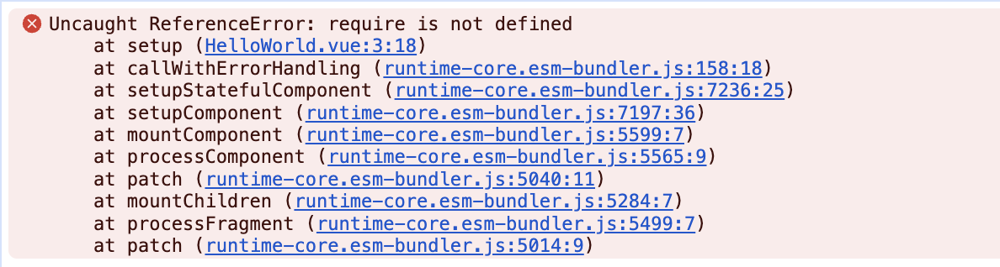
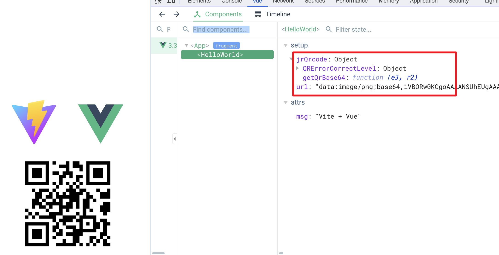
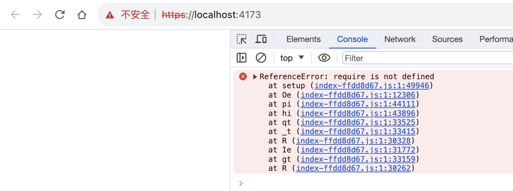

# 在 vite 中使用 require
我们知道, vite 中的[开发服务器是基于原生 ES 模块](https://cn.vitejs.dev/guide/), 而 require 是 commonJS 的语法, 因此我在 Vue2 项目中用到的 jr-qrcode.js 就没办法在 Vue3 + vite 的开发组合中使用, 会报错

```js
import { ref } from 'vue'
const jrQrcode = require('jr-qrcode')

const url = ref('')
url.value = jrQrcode.getQrBase64('Hello, World')
```


我们应该怎么处理呢? 先说下我使用的 `vite` 和 `Vue` 版本
```json
{
  "dependencies": {
    "vue": "^3.3.4"
  },
  "devDependencies": {
    "vite": "^4.4.0"
  }
}
```

## vite-plugin-commonjs
[这款插件](https://github.com/originjs/vite-plugins/tree/main/packages/vite-plugin-commonjs) 就是将 commonJS 转为 esm. 我是在[这里](https://github.com/vitejs/vite/issues/3409)发现这款插件的. 先来安装
```shell
yarn add @originjs/vite-plugin-commonjs --dev
```
接着在 vite.config.js 中增加配置. 📖 注意我们在 `esbuildCommonjs` 中告诉插件需要转换的是哪些包 
```js
import { defineConfig } from 'vite'
import vue from '@vitejs/plugin-vue'
import basicSsl from '@vitejs/plugin-basic-ssl'
import { viteCommonjs, esbuildCommonjs } from '@originjs/vite-plugin-commonjs' // 


// https://vitejs.dev/config/
export default defineConfig({
  plugins: [vue(), basicSsl(), viteCommonjs()], //
  server: {
    https: true
  },
  esbuildOptions: { //
    plugins: [
      esbuildCommonjs(['jr-qrcode']) 
    ]
  }
})
```


## 生产环境
TO BE CONTINUED...
<!-- 上面解决的只是开发环境, 如果我们先后执行打包和预览的命令, 熟悉的报错又出现了
```
yarn run build
yarn run preview
```


哈哈哈, 不过不要着急, 这次的问题更好解决, [因为](https://github.com/originjs/vite-plugins/issues/9) vite 使用 rollup 打包, 而 rollup 是支持 require 的. 不过还是要增加一点配置

```js
``` -->


谢谢你看到这里😊