<!-- TOC -->

- [canvas](#canvas)
  - [基本使用](#%E5%9F%BA%E6%9C%AC%E4%BD%BF%E7%94%A8)
    - [渲染文本](#%E6%B8%B2%E6%9F%93%E6%96%87%E6%9C%AC)
  - [画图形](#%E7%94%BB%E5%9B%BE%E5%BD%A2)
    - [绘制路径](#%E7%BB%98%E5%88%B6%E8%B7%AF%E5%BE%84)
    - [绘制三角形](#%E7%BB%98%E5%88%B6%E4%B8%89%E8%A7%92%E5%BD%A2)
    - [移动画笔🖌️](#%E7%A7%BB%E5%8A%A8%E7%94%BB%E7%AC%94)
    - [绘制直线](#%E7%BB%98%E5%88%B6%E7%9B%B4%E7%BA%BF)
    - [绘制弧线和圆](#%E7%BB%98%E5%88%B6%E5%BC%A7%E7%BA%BF%E5%92%8C%E5%9C%86)
    - [绘制贝塞尔曲线](#%E7%BB%98%E5%88%B6%E8%B4%9D%E5%A1%9E%E5%B0%94%E6%9B%B2%E7%BA%BF)
    - [绘制矩形](#%E7%BB%98%E5%88%B6%E7%9F%A9%E5%BD%A2)
    - [Path2D 对象](#path2d-%E5%AF%B9%E8%B1%A1)
  - [应用样式和颜色](#%E5%BA%94%E7%94%A8%E6%A0%B7%E5%BC%8F%E5%92%8C%E9%A2%9C%E8%89%B2)
    - [颜色](#%E9%A2%9C%E8%89%B2)
    - [透明](#%E9%80%8F%E6%98%8E)
    - [线的样式](#%E7%BA%BF%E7%9A%84%E6%A0%B7%E5%BC%8F)
      - [miterLimit](#miterlimit)
    - [虚线](#%E8%99%9A%E7%BA%BF)
    - [渐变](#%E6%B8%90%E5%8F%98)
    - [模式](#%E6%A8%A1%E5%BC%8F)
    - [阴影](#%E9%98%B4%E5%BD%B1)
    - [Canvas 填充规则](#canvas-%E5%A1%AB%E5%85%85%E8%A7%84%E5%88%99)
  - [文字](#%E6%96%87%E5%AD%97)
    - [绘制文字](#%E7%BB%98%E5%88%B6%E6%96%87%E5%AD%97)
    - [文字样式](#%E6%96%87%E5%AD%97%E6%A0%B7%E5%BC%8F)
    - [高级文字测量](#%E9%AB%98%E7%BA%A7%E6%96%87%E5%AD%97%E6%B5%8B%E9%87%8F)
    - [可访问性](#%E5%8F%AF%E8%AE%BF%E9%97%AE%E6%80%A7)

<!-- /TOC -->

# canvas

## 基本使用
```html
<canvas id="canvasDraw" width="200" height="200"></canvas>
```
`<canvas>` 和 `` 元素很像, 但是它自身只有 `width` 和 `height` 这两个可选属性, 而 `id` 属性是所有 `HTML` 元素都有的全局属性. 如果省略了 `width` 和 `height`, 那么 `<canvas>` 将默认 `300px` 宽和 `150px` 高.

如果渲染出来的 `<canvas>` 有些扭曲, 那么尝试给 `<canvas>` 元素加上 `width` 和 `height` 属性, 而不是使用 `CSS`

`<canvas>` 元素可以像一般的图像一样增加样式, 但是这些样式却不会影响在 `<canvas>` 上实际的绘制. 如果没有任何样式, `<canvas>` 初始时就是透明

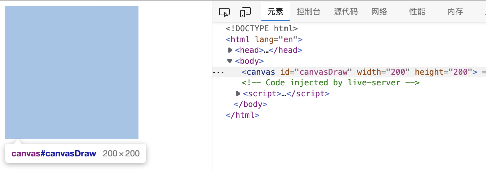

就像 `img` 的 alt 属性一样, `<canvas>` 也要提供一个兜底的内容, 在其无法加载或浏览器不支持 `<canvas>` 的情况下显示. 兜底内容是很有必要的, 因为 `<canvas>` 不具备任何可访问性, 因此类似屏幕阅读器这样的辅助工具才可以识别出 `<canvas>` 中的兜底内容.
```html
<canvas id="canvasDraw" width="200" height="200">
  <h4>Sorry Canvas is not available on your agent.</h4>
</canvas>
```
最后就是 `<canvas>` 元素要求结束标签 `</canvas>`, 不可以🙅是自结束的. 如果没有提供结束标签, 那么 `<canvas>` 后面的元素都将被认为是兜底内容.

### 渲染文本
`<canvas>` 创建了一个大小固定的绘制接口, 这个接口暴露了一个或多个的`渲染上下文(rendering context)`, 通过渲染上下文可以创建和操纵展示的内容. 渲染上下文不仅有 `2D` 的, 还有 `3D` 的.

通过调用 `canvas` 的 `getContext()` 方法可以获得渲染上下文. 这个方法接收一个参数, 及渲染上下文的类型. 如果我们要获得 `2D` 类型的渲染上下文, 就传字符串 `'2d'` 即可.
```js
const canvas = document.getElementById('canvasDraw')
const context = canvas.getContext('2d')
```
当然对于不支持 `<canvas>` 的浏览器, 脚本不能继续执行下去, 通过判断 `canvas` 元素是否有 `getContext` 方法来检测浏览器的是否支持 `<canvas>`

```js
const canvas = document.getElementById('canvasDraw')
if (!canvas.getContext) {
  // ...
} else {
  const context = canvas.getContext('2d')
}
```

最后扯一点和布局有关的, `<canvas>` 和 `` 一样, `display` 默认为 `inline`, 所以即便有了宽度也无法通过 `margin: 0 auto;` 居中, 如果想要居中, 就改成 `display: block;`

## 画图形 
### 绘制路径
路径(`path`)由许多点连接而成, 连接这些点的可以是不同的形状——曲线或直线、不同宽度和不同颜色. 任何一个路径, 甚至子路径都是可以闭合的. 使用路径绘制图形需要下面一些步骤
- 创建路径起点
- 使用画图命令画出路径
- 描边(`stroke`)路径或填充(`fill`)路径来渲染图形

绘制路径需要以下的 API
- `beginPath`
  - 这个方法清空子路径列表并新建一条路径. 没有参数, 无返回值(返回 `undefined`). 
- `closePath`
  - 尝试从当前点添加一条直线到当前子路径的起点. 如果图形已经闭合或者只有一个点, 那么这个函数什么也不做. 关于子路径看下面的 `moveTo`
- `stroke`
  - 绘制当前路径或给定路径.
- `fill`
  - 填充路径组成的封闭区域

1️⃣第一步就调用 `beginPath()` 创建一个路径(`Path`). 在内部, 路径是由子路径(`sub-path`)列表组成的, 子路径可以是直线、弧线等等. 每次调用 `beginPath` 方法子路径列表都会被清空, 然后我们可以绘制新的形状.

📖注意: 如果当前路径为空, 比如刚刚调用了 `beginPath()`, 那么第一个路径构建命令就是调用 `moveTo()`.

看下面的例子
> 😄顺带说一下在 `VS Code` 中写 `canvas` 没有提示的问题如何解决, 那就是在获取 `canvas` 元素的那一行前面加上注解, [可以看这里](https://stackoverflow.com/questions/32201725/html5-canvas-intellisense-in-visual-studio-code)
```js
/** @type {HTMLCanvasElement} */
const canvas = document.getElementById('canvasDraw')
if (!canvas.getContext) {

} else {
  const ctx = canvas.getContext('2d')

  ctx.beginPath()
  ctx.moveTo(10, 10) // 第一个子路径
  ctx.lineTo(200, 10)

  ctx.moveTo(10, 200) // 第二个子路径
  ctx.lineTo(200, 200)
  
  ctx.stroke()
}
```
从上面的例子就比较容易理解路径和子路径了, 不然 `closePath` 这个方法的解释让初学者很迷.

2️⃣第二步就是调用那些真正绘制路径的方法啦.

3️⃣第三步是可选的的一步, 就是调用 `closePath`.

📖注意: 当调用 `fill` 方法时, 任何非封闭的图形都会自动封闭, 因此没有必要调用 `closePath`. 而调用 `stroke` 却不是这样.

### 绘制三角形
画三角形的思路就是画两条边, 然后调用 `fill` 方法. 例子中绘制一个等边三角形
```js
ctx.beginPath();
ctx.moveTo(100, 10)
ctx.lineTo(200, 10)
ctx.lineTo(150, Math.sqrt(3) * 50 + 10)
ctx.fill()
```

可以, 但是有点小问题, 感觉三角形的腰有些锯齿感, 不清楚. 这跟 `<canvas>` 元素本身的大小设置有关系

### 移动画笔🖌️
这就跟 `moveTo` 有很大的关系啦. 这个函数自身不绘制任何东西, 只是将「画笔」移动到新的位置.

### 绘制直线
使用 `lineTo(x, y)` 函数绘制直线. `lineTo` 方法从当前子路径的最后一点点画一条直线到点坐标 `(x,y)`. 如果没有当前子路径, 那么最后一点可以由 `moveTo` 指定.

📖注意: 这个方法和其他方法一样, 这方法本身并不直接渲染直线, 如果要看到画出来的直线, 请调用 `fill()` 或 `stroke()` 方法.
```js
ctx.beginPath()
ctx.moveTo(25, 25)
ctx.lineTo(105, 25)
ctx.lineTo(25, 105)
ctx.fill()
```
### 绘制弧线和圆
需要两个函数

`arc(x, y, radius, startAngle, endAngle, counterclockwise)`
  - 将一个圆弧添加到当前的子路径,
  - 这个方法以 `(x, y)` 为中心, 以 `radius` 为半径画圆弧. 圆弧从 `startAngle` 角度开始, 在 `endAngle` 角度结束. 🤯角度是从 `x` 轴正半轴开始算的❗️❗️❗️
  - 绘制方向是 `counterclockwise`. `boolean` 值, 如果是 `true` 那么绘制方向是逆时针. 默认是 `false`, 即顺时针绘制圆弧.
  - 📖注意这里的度不是角度, 而是弧度. 角度和弧度的转换公式为 `弧度 = (π / 180) * 角度`
  - ```js
    ctx.beginPath()
    ctx.arc(300, 300, 100, 0, 3 / 2 * Math.PI, false);
    ctx.stroke()
  - 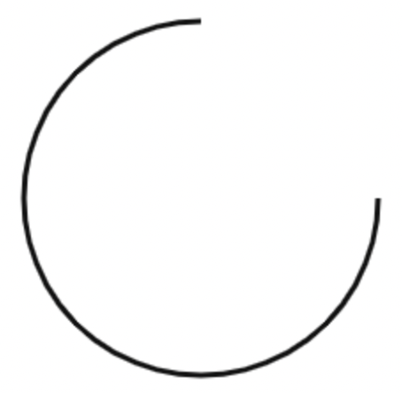

`arcTo(x1, y1, x2, y2, radius)`
  - 根据控制点 `(x1, y1)` `(x2, y2)` 和半径 `radius` 绘制圆弧. 使用当前点与 `(x1, y1)` 点构成的直线, 和 `(x1, y1)` 与 `(x2, y2)` 构成的直线, 一起作为圆弧的切线. 换句话说, 这个圆弧与两条线相切.
  - 画出来的圆弧将会自动与当前子路径的最后一个点直线连接, 如果当前路径列表为空, 那么就连接 `moveTo` 的点. 这个方法通常用来绘制圆角.
  - ```js
      ctx.beginPath()
      ctx.strokeStyle = '#666'
      ctx.moveTo(20, 20)
      ctx.lineTo(200, 20)
      ctx.lineTo(200, 200)
      ctx.stroke()

      ctx.beginPath()
      ctx.strokeStyle = '#111'
      ctx.lineWidth = 3
      ctx.moveTo(20, 20)
      ctx.arcTo(200, 20, 200, 200, 100);
      ctx.stroke()
  - 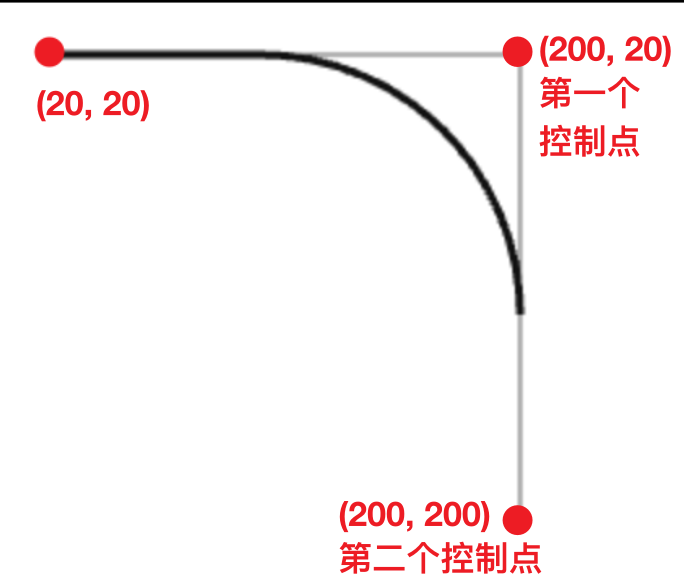
### 绘制贝塞尔曲线
二次贝塞尔曲线和三次贝塞尔曲线都非常有用, 它们通常用来绘制复杂的自然(organic)图形. CSS 的 animation-timing-function 属性可以调用 cubic-bezier 函数来指明动画的缓动函数.

- `quadraticCurveTo(cp1x, cp1y, x, y)`
  - 将二次贝塞尔曲线添加到当前子路径. 这个方法需要两个点, 第一个点是`控制点`, 第二个点是`结束点`. `开始点`就是当前路径的最后一个点, 也可以是 `moveTo` 指定的点.
  - 前两个参数就是控制点的坐标, 后两个参数就是结束点的坐标.
  - ```js
    ctx.moveTo(100, 100)
    ctx.quadraticCurveTo(200, 300, 400, 150);
    ctx.stroke()
  - 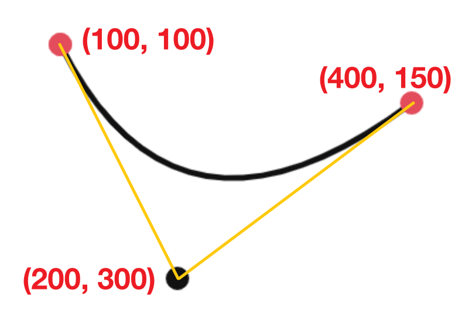
- `bezierCurveTo(cp1x, cp1y, cp2x, cp2y, x, y)`
  - 将三次贝塞尔曲线添加到当前子路径. 三次贝塞尔曲线需要三个点, 两个控制点和一个结束点. 开始点就是当前路径的最后一个点, 也可以是 `moveTo` 指定的点.
  - 六个参数分别是两个控制点和一个结束点的坐标.
  - ```js
    ctx.moveTo(100, 100)
    ctx.bezierCurveTo(200, 300, 300, 100, 500, 200);
    ctx.stroke()
  - 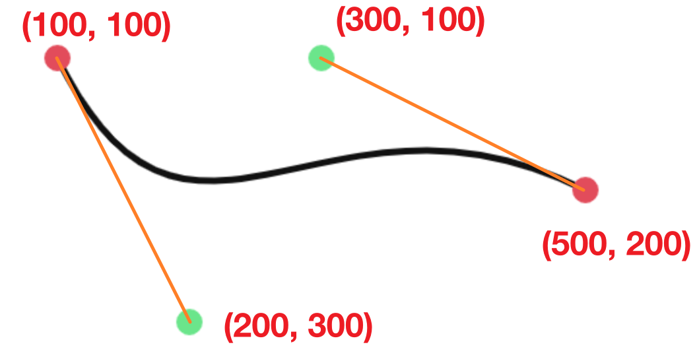
### 绘制矩形
与 `SVG` 不同, `<canvas>` 仅支持两种原始图形: 矩形和路径. 所有其他图形都必须由一个或多个路径连接而成.
- `fillRect(x, y, width, height)`
  - 填充一个矩形, 填充的样式由 `fillStyle` 决定.
  - 这个方法直接在 `<canvas>` 上绘制, 而不会修改当前路径, 因此任何后续的 `fill()` 或 `stroke()` 方法都不会对矩形有影响.
  - 参数, 分别是矩形开始点的坐标, 矩形的宽和高. 如果宽高是正值, 那么向右向下绘制矩形, 否则向左向上绘制.
  - ```js
    ctx.fillStyle = '#ff5e57'
    ctx.fillRect(30, 30, 200, 160)
  - 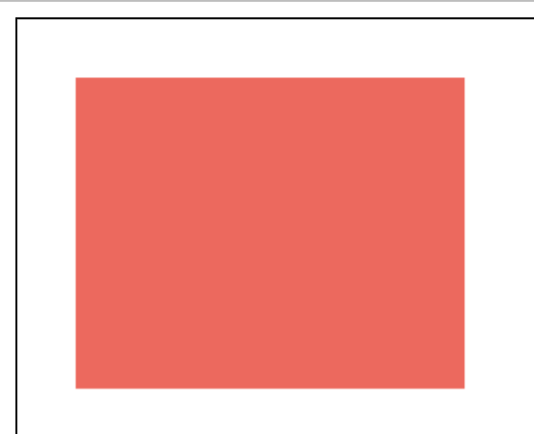
  - 如果想要覆盖整个 `<canvas>` 可以这样写
  - ```js
    ctx.fillRect(0, 30, 200, 160)
- `strokeRect(x, y, width, height)`
  - 绘制矩形的边框, 根据 `strokeStyle` 和其他上下文的设置. 这个方法同样不会影响当前路径, 也不会被后续的 `fill()` 或 `stroke()` 影响.
  - 参数同 `fillRect()`
  - ```js
    ctx.strokeStyle = '#ff5e57'
    ctx.lineWidth = 10
    ctx.strokeRect(30, 30, 200, 160)
  - 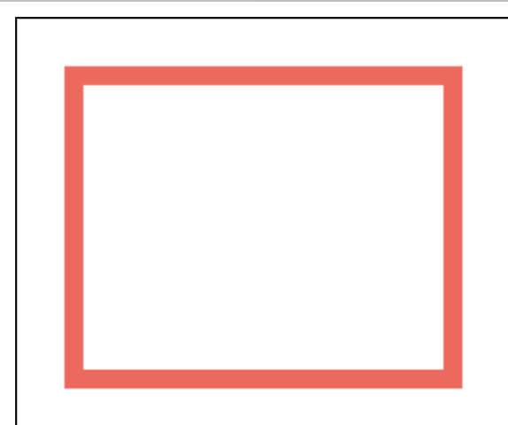
- `clearRect(x, y, width, height)`
  - 通过将矩形区域内的像素设置成[透明黑色](https://drafts.csswg.org/css-color/#transparent-black)来清除像素.
  - 关于什么是透明黑色, 可以看 `CSS` 规范中的对两个颜色的定义, 首先是 `不透明黑(opaque black)`, 其对应的颜色是 `rgb(0 0 0 / 100%)`, 然后是`透明黑(transparent black)`, 对应的颜色是 `rgb(0 0 0 / 0)
  - 📖 MDN 强调了不正确使用路径而调用 `clearRect()` 可能会导致意想不到的副作用, 因此, 调用 `clearRect()` 后如果想要绘制其他内容一定要调用 `beginPath()`
  - 参数同 `fillRect()`
  - 下面的例子是清除整个画布, 这段代码通常用在动画每一帧的开始.
  - ```js
    ctx.clearRect(0, 0, canvas.width, canvas.height)
- `rect(x, y, width, height)`
  - 上面的绘制矩形的方法都是直接将矩形绘制在 `canvas` 上, 而 `rect()` 函数确是将一个矩形子路径添加到当前路径. 和其他只添加路径的方法相似, 这个方法也不直接绘制任何东西, 只有后续调用 `fill()` 或 `stroke()` 才会绘制矩形
  - 参数同上.
  - 在这个方法执行之前, `moveTo(x, y)` 方法就会自动调用. 换句话说, 当前画笔🖌️的位置自动移动到 `(x, y)`
  - ```js
    ctx.beginPath()
    ctx.moveTo(100, 100)
    ctx.arc(100, 100, 40, 0, 2 * Math.PI)

    ctx.rect(140, 140, 80, 80)
    ctx.fill()
  - 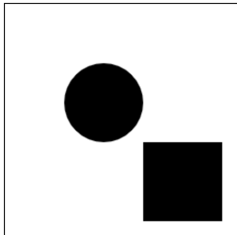
### `Path2D` 对象
在之前的例子中, 绘制图形需要一系列路径和命令, 为了简化代码和提高性能, 可以使用 `Path2D` 对象.

`Path2D` 这个接口用来声明一个路径, 这个路径之后可以被 `canvas` 对象使用. `canvas` 对象的绘制路径的方法也存在 `Path2D` 上.
- `Path2D()`
  - 构造函数返回一个刚刚初始化的 `Path2D` 对象. 可以接受另一个 `path` 或 `SVG` `path` 字符串作为可选参数.
所有的路径方法, 比如 `moveTo`, `rect`, `arc` 等同样存在于 `Path2D` 对象上. 
  - ```js
    const rect = new Path2D()
    rect.rect(100, 100, 200, 200)

    const circle = new Path2D()
    circle.arc(200, 200, 100, 0, Math.PI * 2)

    ctx.stroke(rect)
    ctx.stroke(circle)
    ```
  - 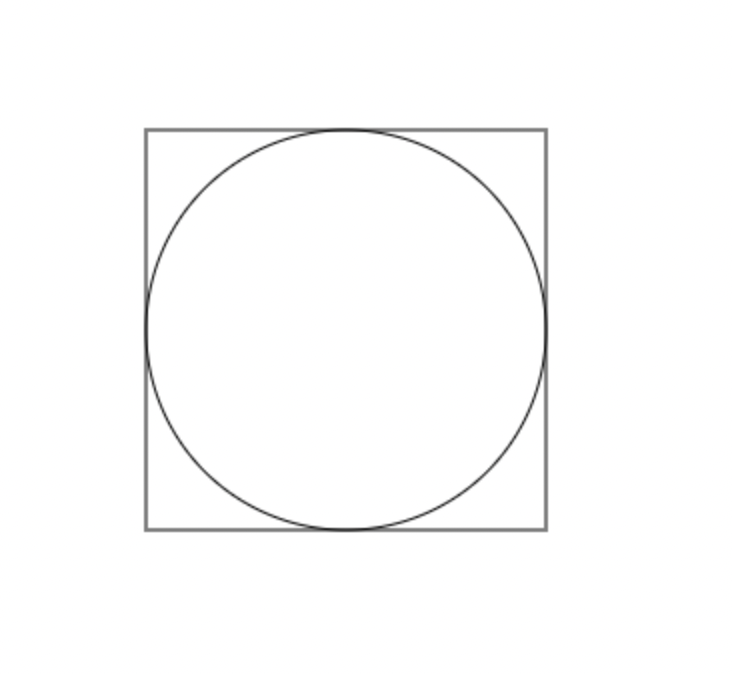
  - 在构建 `Path2D` 对象时, 同样可以传递 `SVG` 路径字符串作为参数. 
  - ```js
    const heart = new Path2D(`M 10,30
          A 20,20 0,0,1 50,30
          A 20,20 0,0,1 90,30
          Q 90,60 50,90
          Q 10,60 10,30 z`)
    ctx.stroke(heart)
  - 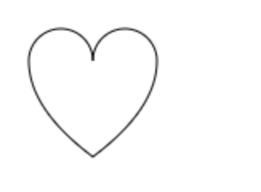

`Path2D API` 同样需要使用 `addPath()` 方法将不同的路径结合起来. 

- `addPath(path, transform)`
  - 添加一个 `Path2D` 对象到另一个 `Path2D` 对象上.
  - `transform` 是一个可选的矩阵参数.
  - ```js
    const rect = new Path2D()
    rect.rect(100, 100, 200, 200)
    
    const rect2 = new Path2D()
    rect2.arc(400, 200, 100, 0, Math.PI * 2)

    rect.addPath(rect2)
    ctx.stroke(rect)
  - 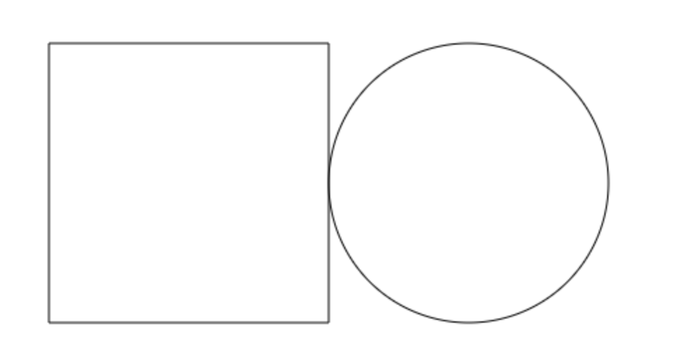

## 应用样式和颜色
屏幕阅读器无法读取 `<canvas>` 的内容. 如果 `<canvas>` 仅仅用做装饰页面, 那么可以在开始标签上增加 `role="presentation"` 属性.

### 颜色
如果想要对图形应用颜色, 可以使用 `fillStyle` 和 `strokeStyle`
- `fillStyle`
  - 填充图形的颜色或渐变. 默认值为 `#000`, 黑色
  - 任何合法的 `CSS` 颜色值的字符串都可以作为 `fillStyle` 的值.
  - ```js
    function fillStyleTest(context) {
      for (let i = 0; i < 15; i++) {
        for (let j = 0; j < 15; j++) {
          context.fillStyle = `#${toHex(i * 17)}${toHex(j * 17)}bb`
          context.fillRect(i * 17, j * 17, 25, 25)
        }
      }
    }

    function toHex(num) {
      return num.toString(16).padStart(2, '0')
    }
  - 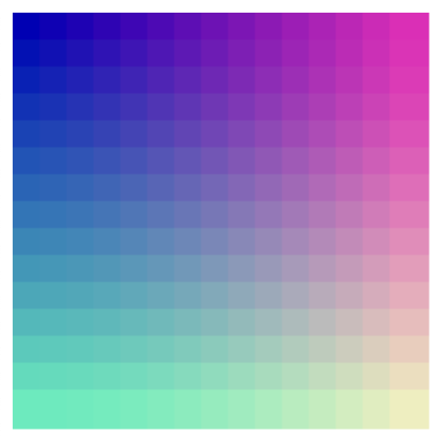
- `strokeStyle`
  - 勾勒图形轮廓的颜色或渐变. 默认值为 `#000`, 黑色
  - 任何合法的 `CSS` 颜色值的字符串都可以作为 `strokeStyle` 的值.
  - ```js
    function strokeStyleTest(context) {
      for (let i = 0; i < 15; i++) {
        for (let j = 0; j < 15; j++) {
          context.strokeStyle = `#${toHex(i * 17)}${toHex(j * 17)}bb`
          context.strokeRect(300 + i * 17, j * 17, 17, 17)
        }
      }
    }
  - 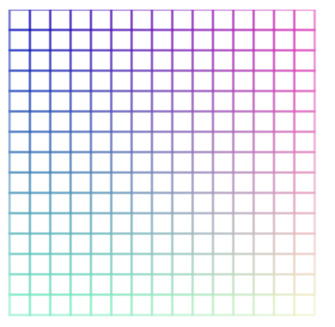

从上面的例子中可以看到, 当设置了 `fillStyle` 或 `strokeStyle` 之后, 新的值就会成为之后绘制图形的默认值. 但是在路径中就有些不一样
```js
// fill
context.beginPath()
context.moveTo(100, 100)
context.fillStyle = 'lightblue'
context.rect(100, 100, 100, 100)
context.fill()
context.fillStyle = 'pink'
context.arc(150, 50, 50, 0, Math.PI * 2)
context.fill()
context.closePath()

// stroke
context.beginPath()
context.moveTo(300, 100)
context.lineWidth = 10
context.lineTo(300, 200)
context.stroke()
context.lineWidth = 2
context.lineTo(400, 100)
context.stroke()
```
从下图看出, 虽然两次调用 `fill()` 之前都设置了不同的 `fillStyle` 但是只有最后一个生效了. 但是 `stroke()` 就不是这样, 每次调用 `stroke()` 之前设置的 `lineWidth` 都生效了
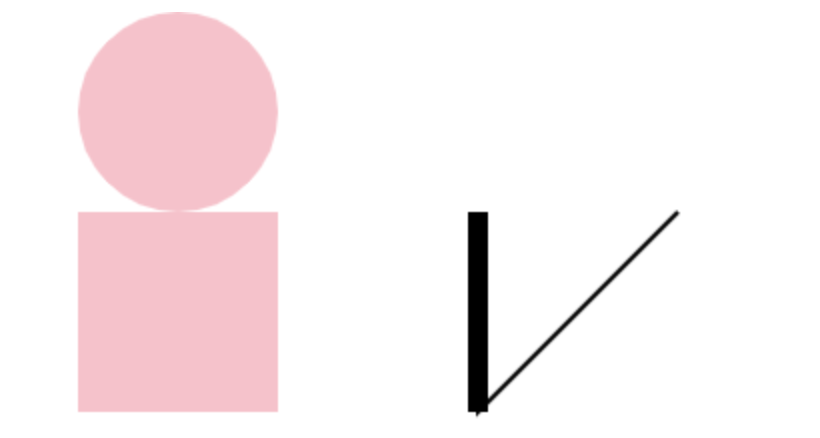

另外, 既然说到 `stroke`, 调用 `stroke()` 和 `fill()` 的顺序不一样也会造成不同的绘制效果.

先 `stroke()` 后 `fill()`, `fill()` 的蓝色就覆盖了 `stroke()` 的粉色; 翻过来 `stroke()` 的粉色覆盖了 `fill()` 的蓝色, 这一点要注意, 特别在 `lineWidth` 值越大差异越明显.
```js
context.beginPath()
context.moveTo(100, 100)
context.rect(100, 100, 100, 100)
context.fillStyle = 'lightblue'
context.strokeStyle = 'pink'
context.lineWidth = 20
context.stroke()
context.fill()
context.closePath()

context.beginPath()
context.moveTo(300, 100)
context.rect(300, 100, 100, 100)
context.fill()
context.stroke()
context.closePath()
```
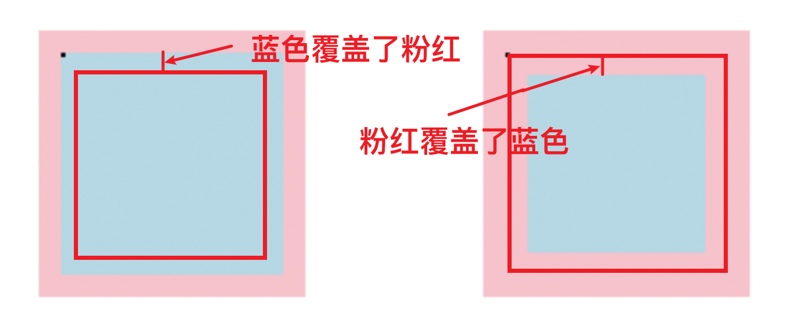
### 透明
通过设置 `globalAlpha` 属性或使用带有透明通道的颜色(比如, `rgba(100, 128, 87, 0.5)` 或 `#fa982100`)来绘制透明的效果.
- `globalAlpha`
  - 可选值在 `0.0` 到 `1.0` 之间. `0.0` 表示全透明, `1.0` 表示完全不透明. 默认值为 `1.0`. 在这个范围之外的值, 包括 `Infinity` 和 `NaN` 都会被忽略.
  - ```js
    context.globalAlpha = 0.5

    context.fillStyle = 'orange'
    context.fillRect(100, 100, 100, 100)
    context.fillStyle = 'skyblue'
    context.fillRect(150, 150, 100, 100)
  - 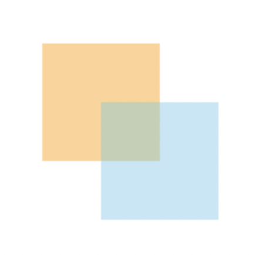
  - ```js
    // 完全不透明画个蓝色的底
    context.globalAlpha = 1
    context.fillRect(300, 100, 100, 100)

    // 0.3 透明度填充1/4的圆
    context.globalAlpha = 0.3
    context.fillStyle = '#000'
    for (let i = 1; i < 6; i++) {
      context.beginPath()
      context.moveTo(300, 100)
      context.lineTo(300 + 20 * i, 100)
      context.arc(300, 100, 20 * i, 0, Math.PI / 2)
      context.lineTo(300, 100 + 20 * i)
      context.fill()
    }
  - 同样的, 如果相同透明度的图形堆叠在一起, 那么越在下方的图形, 就会变得越不透明. 在这个例子中, 就是半径越小的善行, 最后展示的效果就越不透明.
  - 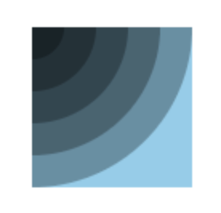
### 线的样式
下面的属性可以用来设置线的样式
- `lineWidth`
  - 设置线的宽度. 使用 `stroke()`, `strokeRect()`, 和 `strokeText()` 都可以画线
  - ```js
    [1, 2, 5].forEach((width, index) => {
      context.lineWidth = width
      context.beginPath()
      context.moveTo(100, 100 + index * 100)
      context.lineTo(100, 100 + index * 100 + 70)
      context.stroke()
      context.closePath()

      context.strokeRect(150, 100 + index * 100, 50, 50)
      context.font = '40px serif'
      context.strokeText('Hello 早上好', 200, 100 + index * 100)
    });
  - 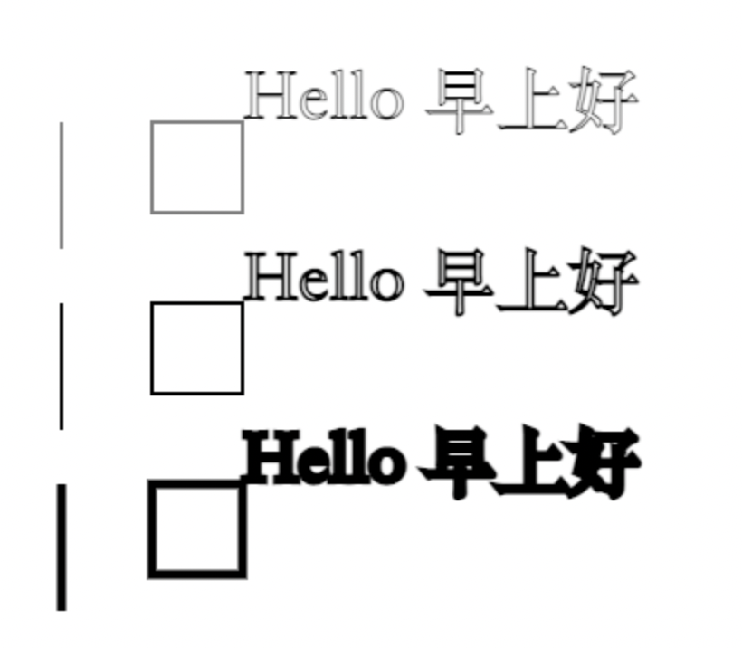
- `lineCap`
  - 设置线端点的形状. 可选的值有下
    - `butt`: 默认值. 端点为方形.
    - `round`: 端点为圆形.
    - `square`: 端点为方形, 但是额外加上一个长方形, 和线一样宽, 但只有线宽度的一半
  - ```js
    ['butt', 'round', 'square'].forEach((lineCap, i) => {
      context.beginPath()
      context.lineCap = lineCap
      context.lineWidth = 20
      context.moveTo(100, 100 + i * 50)
      context.lineTo(200, 100 + i * 50)
      context.stroke()
      context.closePath()
    })
  - 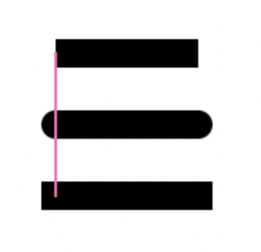
- `lineJoin`
  - 设置两条端点相交时的形状. 如果两条线方向相同, 那么 `lineJoin` 在连接处没有效果. 如果一条线退化为宽度 `0` 那么 `lineJoin` 同样没有效果
  - `lineJoin` 可以选择以下的属性
    - `round`: 以线共同端点为中心, 填充一个扇形, 半径等于线宽.
    - `bevel`: 在线共同端点填充一个三角形.
    - `miter`: 默认值. 延长线的两端直到相交, 效果是填充额外的菱形. 这个值受 `miterLimit` 的影响.
  - ```js
    ['round', 'bevel', 'miter'].forEach((lineJoin, i) => {
      context.beginPath()
      context.lineWidth = 20
      context.lineJoin = lineJoin
      context.moveTo(100, 100 + i * 100)
      context.lineTo(200, 150 + i * 100)
      context.lineTo(250, 100 + i * 100)
      context.stroke()
      context.closePath()
    })
  - 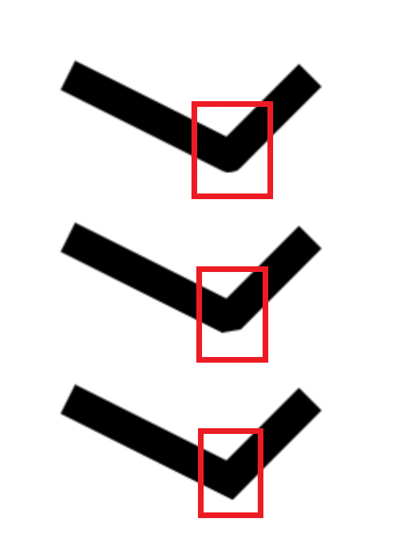
#### `miterLimit`
正如上面的图片, 当 `lineJoin` 为 `miter` 时, 相交线的外侧边缘延长至相交. 如果两条线之间的角度较大, 那么这个外侧边缘交点离内侧边缘焦点不会太远. 但是如果角度较小, 那么内侧焦点和外侧焦点之间的距离(`miter length`, `miter` 是「锯齿」的意思)就会指数级增长.

`miterLimit` 属性决定了外侧焦点距离内侧焦点可以多远. 如果超过了, 那么就会使用 `bevel` 的效果. `miterLimit` 属性的默认值为 `10`. 这个属性只影响最后的渲染效果, 如果当前显示有缩放或者其他变换, 也不会影响 `miterLimit` 的效果.

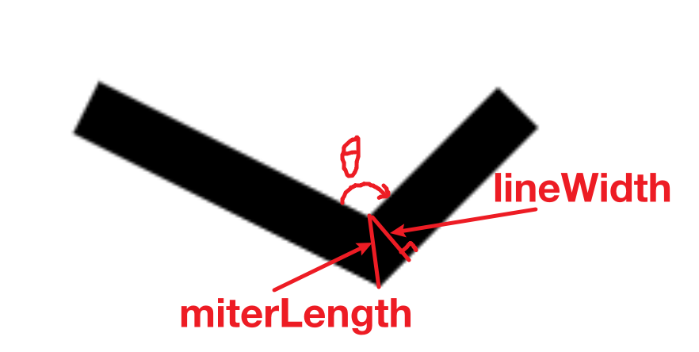
从上面看到, 一个公式
> `miterLimit = max minterLength / lineWidth = 1 / sin( min(θ / 2) )`

所以, 将默认值 `10` 带入上面的公式, 可以得到 `min(θ / 2) = 0.2`, `θ` 约为 `11` 度, 也就是默认值 `10` 可以阻止所有角度小于 `11` 的度的相交线的效果. 如果 `miterLimit` 是 `√2` 可以阻止所有的锐角. `miterLimit` 小于 `1` 是不合法的因为 `sin` 值不可能大于 `1`. 所以总结一下就是 `θ` 越大, `miterLimit` 越大;

```js
context.lineWidth = 20;
[1, 1.5, 2, 3, 6, 10].forEach((limit, i) => {
  context.beginPath()
  context.miterLimit = limit
  context.moveTo(0 + i * 100, 0)
  context.lineTo(100 + i * 100, 100)
  context.lineTo(100 + i * 100 - i * 10, 20)
  context.stroke()
  context.closePath()
})
```
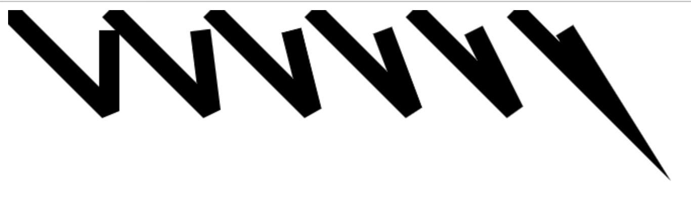

### 虚线
`setLineDash` 和 `lineDashOffset` 方法用来绘制虚线.
- `setLineDash`
  - 指定如何绘制虚线. 接收数组为参数. 数组的前两个元素分别制定虚线中实线部分的长度和实线与实线之间的间隔.
  - 如果数组为空, 那么画出来就是实线. 如果数组中元素的个数为基数, 那么数组元素就会被整体扩充编程偶数个数. 比如 `[1, 3, 2]` 就会被扩充为 `[1, 3, 2, 1, 3, 2]`
  - ```js
    [
      [5, 10],
      [5, 2, 10, 2, 5, 20],
      [20, 6],
      []
    ].forEach((array, i) => {
      context.beginPath()
      context.lineWidth = 5
      context.setLineDash(array)
      context.moveTo(100, 100 + i * 20)
      context.lineTo(300, 100 + i * 20)
      context.stroke()
    })

    context.setLineDash([5, 10])
    context.strokeRect(400, 100, 100, 100)
    context.beginPath()
    context.arc(600, 150, 50, 0, Math.PI * 2)
    context.stroke()
  - 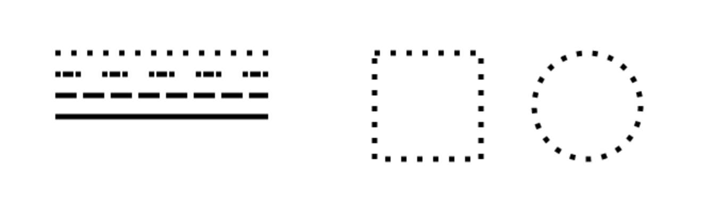
- `lineDashOffset`
  - 设置虚线的偏移. 默认值是 `0.0`. 先看例子, 不然感觉很多人会误解这个偏移是什么意思
  - ```js
    // 正的offset
    for (let i = 0; i < 20; i++) {
      context.beginPath()
      context.setLineDash([90, 10])
      context.lineWidth = 3
      context.lineDashOffset = i * 10
      context.moveTo(100, 50 + i * 10)
      context.lineTo(400, 50 + i * 10)
      context.stroke()
      context.closePath()
    }
    // 负的offset
    for (let i = 0; i < 20; i++) {
      context.beginPath()
      context.setLineDash([90, 10])
      context.lineWidth = 3
      context.lineDashOffset = i * -10
      context.moveTo(500, 50 + i * 10)
      context.lineTo(800, 50 + i * 10)
      context.stroke()
      context.closePath()
    }
  - 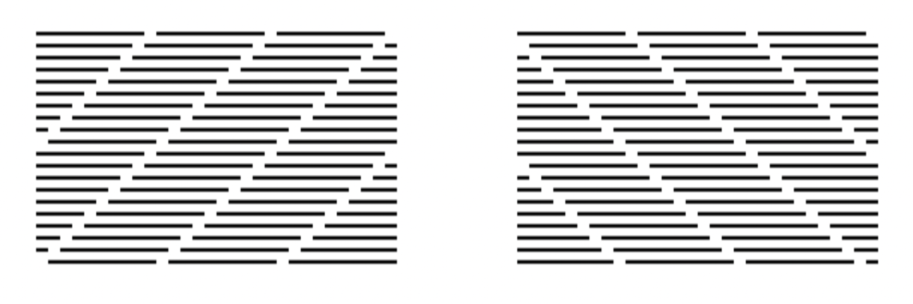
  - 所以, 偏移 `100` 的意思不是先空 `100` 再划线, 而是从线的 `100` 处开始画, 或者说把划线的起点向左⬅️移动了 `100`.

上面不同的 `offset` 连接起来有种连续的感觉, 没错, 我们可以修改 `offset` 的值来实现一些动画效果.

```js
let offset = 0;

function draw() {
  context.clearRect(0, 0, canvas.width, canvas.height)
  context.setLineDash([5, 10])
  offset = offset < 15 ? offset + 1 : 0
  context.lineDashOffset = offset;
  context.strokeRect(100, 100, 100, 100)

  requestAnimationFrame(draw)
}

draw()
```


### 渐变
我们也可以在 `canvas` 中使用线形, 径向和锥形渐变. 下面三个方法可以返回一个 `CanvasGradient` 对象, 将这个对象赋值给 `fillStyle` 或 `strokeStyle` 即可.
- `createLinearGradient(x0, y0, x1, y1)`
  - 创建一个沿着 `(x0, y0)` 和 `(x1, y1)` 连线方向的线形渐变.
  - 📖渐变的坐标是全局的. 相对于当前的坐标空间, 如果在一个图形上应用渐变, 渐变的坐标并不变成图形的渐变.
  - `CanvasGradient` 对象有一个方法 `addColorStop()` 用来添加颜色
  - ```html
    <canvas width="500" height="400" role="presentation"></canvas>
  - ```js
    const linearGradient = context.createLinearGradient(0, 0, canvas.width, canvas.height)
    linearGradient.addColorStop(0, '#ff3f34')
    linearGradient.addColorStop(14 / 100, '#ffa801')
    linearGradient.addColorStop(14*2 / 100, '#ffd32a')
    linearGradient.addColorStop(14*3 / 100, '#05c46b')
    linearGradient.addColorStop(14*4 / 100, '#0fbcf9')
    linearGradient.addColorStop(14*5 / 100, '#00d8d6')
    linearGradient.addColorStop(14*6 / 100, '#3c40c6')

    context.fillStyle = linearGradient
    context.strokeStyle = linearGradient
    context.lineWidth = 20
    context.strokeRect(250, 250, 100, 100)
    context.fillRect(100, 100, 100, 100)
    // context.fillRect(0, 0, canvas.width, canvas.height)
  - 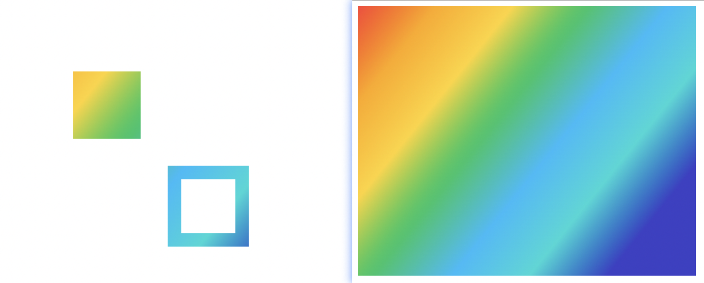
  - 我先准备了一个填满了整个 `canvas` 的线形渐变, 然后绘制了一个和 `canvas` 大小相同的矩形来展示渐变, 然后绘制一个小区域的矩形, 可以看到这个渐变的坐标没有适应小矩形的坐标, 小矩形只是展示了整个渐变的一部分.
  - 整个渐变沿着左上到右下的方向.
- `createRadialGradient(x0, y0, r0, x1, y1, r1)`
  - 创建径向渐变, 需要制定两个圆的大小和圆心坐标.
  - 前三个参数指定径向渐变开始的圆, 分别为圆心坐标和半径(非负), 后三个参数指定径向渐变结束的圆, 分别为圆心坐标和半径(非负)
  - ```js
    let outerSize = 150
    let stop1 = 0.5
    let stop2 = 0.7
    let stop3 = 0.9
    const radialGradient = context.createRadialGradient(200, 200, 0, 200, 200, outerSize)
    radialGradient.addColorStop(stop1, 'pink')
    radialGradient.addColorStop(stop2, 'lightblue')
    radialGradient.addColorStop(stop3, 'orange')

    context.fillStyle = radialGradient
    context.beginPath()
    context.arc(200, 200, 1000, 0, Math.PI * 2)
    context.fill()
    context.closePath()

    context.beginPath()
    context.arc(200, 200, 3, 0, Math.PI * 2)
    context.arc(200 + stop1 * outerSize, 200, 3, 0, Math.PI * 2)
    context.arc(200 + stop2 * outerSize, 200, 3, 0, Math.PI * 2)
    context.arc(200 + stop3 * outerSize, 200, 3, 0, Math.PI * 2)
    context.arc(200, 200, outerSize, 0, Math.PI * 2)
    context.stroke()
  - 可以看到渐变与 `CSS` 中的渐变规则一致
  - 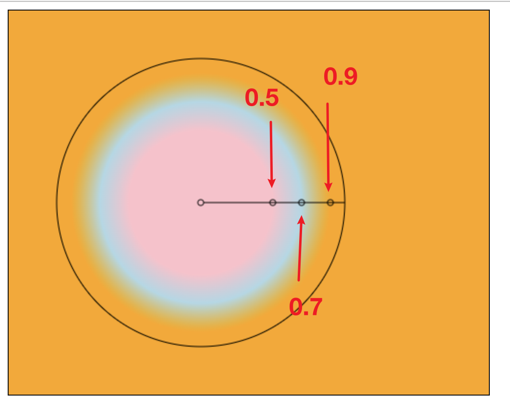
- `createConicGradient(startAngle, x, y)`
  - 围绕一个点创建锥形渐变. startAngle 是渐变开始的弧度, 弧度从 3 点钟方向开始计算, 顺时针.
  - ```js
    const conicGradient = context.createConicGradient(0, 200, 200)
    conicGradient.addColorStop(0, '#fff')
    conicGradient.addColorStop(1, '#111')
    context.fillStyle = conicGradient
    context.fillRect(0, 0, canvas.width, canvas.height)
  - 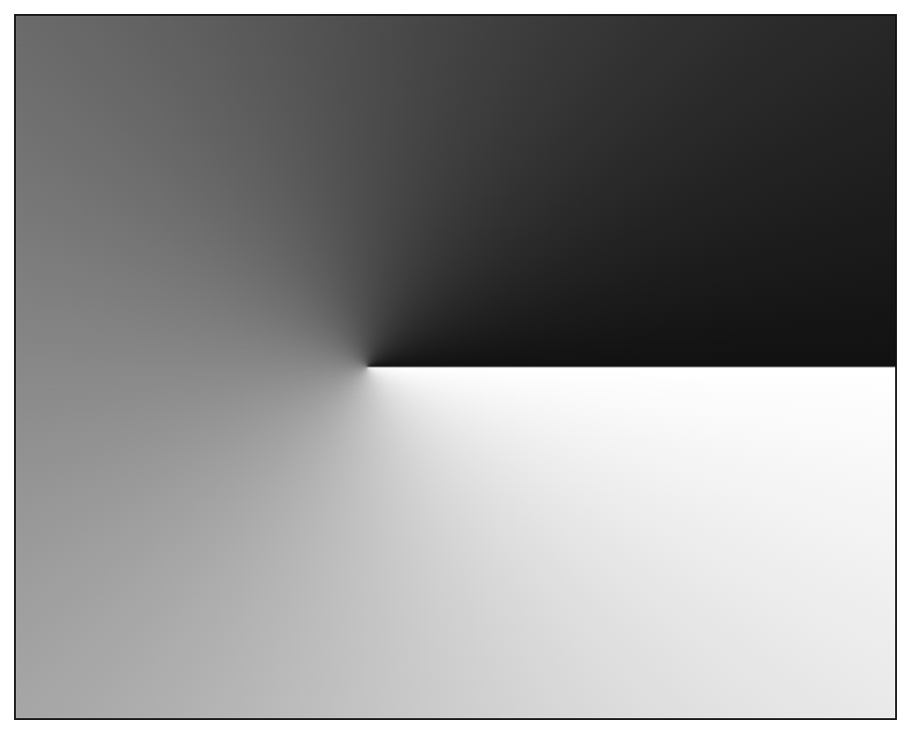
### 模式
- `createPattern(image, repetition)` 
  - 这个方法使用给定的图像和重复次数创建一个模式(`pattern`), 返回 `CanvasPattern` 类型的对象.
  - 这个方法也不会直接绘制任何内容, 必须将返回值赋值给 `fillStyle` 或 `strokeStyle` 才行.
  - 参数介绍
    - `image`: 可以是下面的类型
      - `HTMLImageElement` (``)
      - `SVGImageElement` (`<image>`)
      - `HTMLVideoElement` (`<video>`)
      - `HTMLCanvasElement` (`<canvas>`)等
    - `repetition`: 模式如何重复
      - `repeat`: 在 `x` 和 `y` 两个方向重复
      - `repeat-x`: 在 `x` 方向重复
      - `repeat-y`: 在 `y` 方向重复
      - `no-repeat`: 不重复
      - 如果这个值是空字符串(`''`)或者 `null`, 值将会是 `repetition`.
  - 如果图像没有完全加载, 那么 `createPattern` 将返回 `null`
  - ```html
    
    <canvas width="600" height="500" role="presentation"></canvas>
  - ```js
    const img = document.getElementById('repeat')
    img.onload = () => {
      const pattern = context.createPattern(img, 'repeat')
      context.fillStyle = pattern
      context.fillRect(0, 0, canvas.width, canvas.height)
    }
  - 可以看到的是, 虽然我们限制了 `` 的大小, 但是 createPattern 使用的是图片的原始大小.
  - 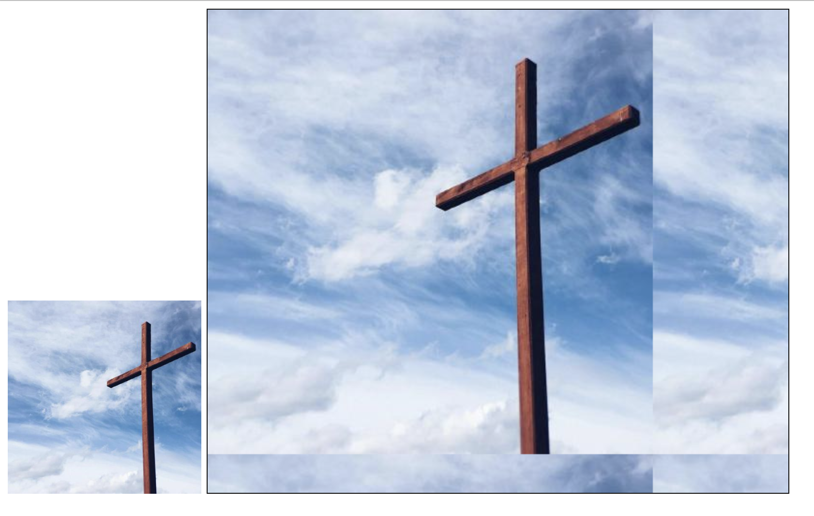
### 阴影
使用阴影需要下面四个属性
- `shadowColor`
  - 指定阴影的颜色, 默认颜色是黑色(`#00000000`, 全 透明黑). 注意阴影的透明度会受到 `fillStyle` 或者 `strokeStyle` 的影响.
  - ```js
    // 阴影
    context.shadowColor = 'pink';
    context.shadowOffsetX = 5;
    context.shadowOffsetY = 2;

    context.font = '35px PingFang'
    context.fillText('Merry Christmas', 100, 100)
  - 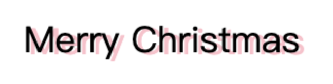
- `shadowOffsetX` 和 `shadowOffsetY`
  - 水平/垂直方向阴影的偏移
  - 当且仅当 `shadowColor` 属性为非透明颜色时才会绘制阴影. 另外 `shadowOffsetX`, `shadowBlur`, 或 `shadowOffsetY` 三个属性中必须有一个不是 `0`.
  - `shadowOffsetX`: 这个属性值是浮点数. 正数表示阴影向右偏移, 负数阴影向左偏移. 默认值为 `0`, 不偏移. `Infinity` 或者 `NaN` 的值将被忽略.
  - `shadowOffsetY`: 正数表示阴影向下偏移, 负数向上偏移
  - ```js
    // 阴影
    context.shadowColor = 'pink'
    context.shadowOffsetX = 20
    context.shadowOffsetY = 20

    context.fillRect(100, 100, 100, 100)

    context.shadowOffsetX = -20
    context.shadowOffsetY = -20
    context.beginPath()
    context.arc(300, 200, 50, 0, Math.PI * 2)
    context.fill()
    context.closePath()

    // 取消阴影
    context.shadowOffsetX = 0
    context.shadowOffsetY = 0
    context.fillRect(300, 0, 100, 100)
  - 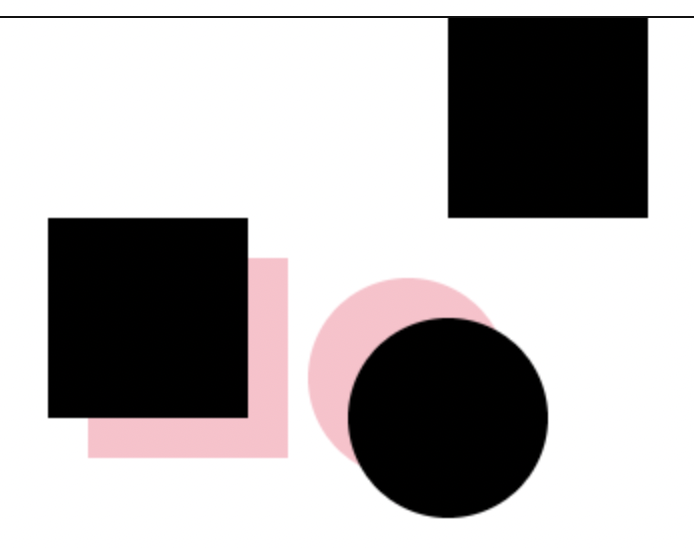
- `shadowBlur`
  - 设置阴影的模糊大小. 默认值为 0, 即阴影不模糊.
  - 这个值不能是非负, 这个值并不是像素值, 也不会收到当前变换矩阵的影响.
  - ```js
    context.shadowColor = 'pink';
    context.shadowOffsetX = 20;
    context.shadowOffsetY = 20;

    [2, 5, 10, 20, 30].forEach((shadowBlur, index) => {
      context.shadowBlur = shadowBlur
      context.fillRect(0 + index * 130, 100, 100, 100);
    })
  - 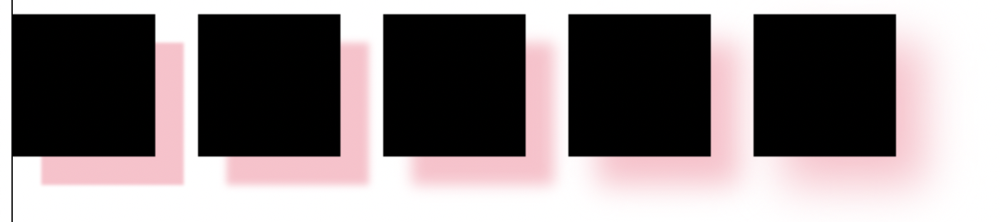
### Canvas 填充规则
当调用 fill 方法时, 可以提供一个可选的参数, 参数指定了填充的算法. 这个算法决定了一个点(point)是在一个路径的内部还是外部, 从而是否绘制这个点. 当路径与自己相交或嵌套时会特别有用.

这个参数仅有两个可选值
- `nonzero`: 默认填充规则.
- `evenodd`: 另一种填充规则. 随便在平面找一点, 通过这点向任意方向画一条无限远的直线箭头, 看这个箭头穿过了几条路径. 如果是奇数, 这个点就是在图形内部, 否则在外部.
```js
context.beginPath();
[4, 3, 2, 1].forEach(radius => {
  context.arc(200, 200, radius * 30, 0, Math.PI * 2)
})
context.fill('evenodd')

context.beginPath();
[4, 3, 2, 1].forEach(radius => {
  context.arc(450, 200, radius * 30, 0, Math.PI * 2)
})
context.fill()
```
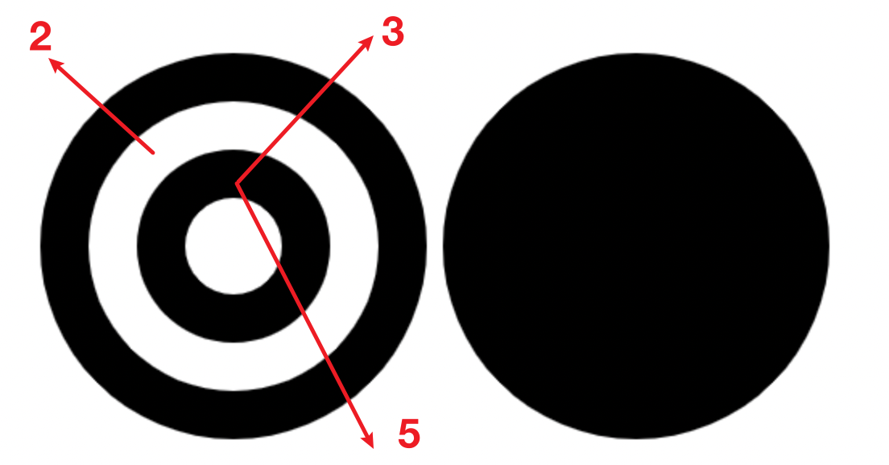

## 文字
### 绘制文字
绘制文字有两个方法 `fillText` 和 `strokeText`
- `fillText(text, x, y, [maxWidth])`
  - 在指定的作为填充文字, 根据当前的 `fillStyle` 为填充颜色. 一个可选的参数是 `maxWidth`, 用来指定文字的最大宽度. 如果超过这个参数浏览器可能使用更小的字号或者紧凑文字来达到要求. 如果没有指明这个参数, 那么文字没有最大宽度限制.
  - 这个方法不会直接在 `canvas` 上绘制文字而不修改当前的路径, 因此后续调用的 `fill()` 或 `stroke()` 对文字无影响.
  - ```js
    context.font = '20px PingFang';
    [80, 100, 120, 160].forEach((maxWidth, index) => {
      context.fillStyle = '#111'
      context.fillText('Happy New Year', 100, 100 + index * 20, maxWidth)
      context.fillStyle = 'red'
      context.fillRect(100, 100 + index * 20, 3, 3)
    })

    context.fillText('Hello, World', 0, 0)
  - 从下面的文字可以看出来, `fillText` 的 `x` 和 `y` 参数不是文字的左上角, 而是左下角. 而且在宽度不够时, 文字被「挤压」
  - 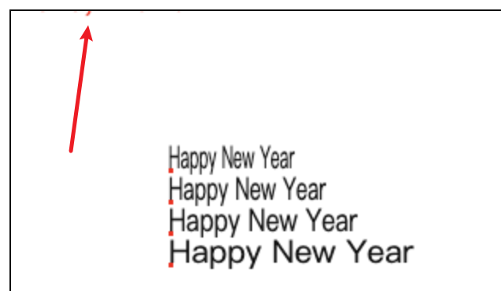
- `strokeText`: 同上
### 文字样式
- `font`
  - 指定当前文字的字体. 和 `CSS font` 属性语法相同. 默认值是 `10px sans-serif`
  - 值可以是 `css font` 属性的任意合法值, 要知道的是 `css` 中的 `font` 必须指定 `font-size` 与 `font-family`, 这也是 `font` 的默认值是 `10px sans-serif` 的一个原因. 📖另一个要注意的是 `font-weight` 必须在 `font-size` 之前. 可以参考我之前关于 `css font` 的[介绍](../02CSS3/33font.md)
  - ```js
    context.font = '10px PingFang'
    context.fillText('Hello, 你好', 10, 20)

    context.font = '30px PingFang'
    context.fillText('Hello, 你好', 10, 50)
    context.fillRect(10, 50, 100, 1) // 画了一条辅助线

    context.font = 'bold 30px PingFang'
    context.fillText('Hello, 你好', 10, 80)
  - 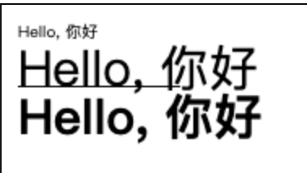
  - 如果需要使用其他字体, 比如 [Google Fonts](https://fonts.google.com/), 可以使用 `FontFace API` 
  - ```js
    function testLoadFont() {
      const fontFace = new FontFace('Server Font', 'url(https://fonts.gstatic.com/s/fasthand/v26/0yb9GDohyKTYn_ZEERkiaE0Urhg0xTY.woff2)')

      document.fonts.add(fontFace);
      fontFace.load().then(() => {
        context.font = '30px "Server Font"'
        context.fillText('Hello, 你好', 10, 50)
      })
    }
  - 
- `textAlign`
  - 指定绘制文字时的对齐方向. 这个和 CSS 中的对齐有些不一样, CSS 中时将文字在一个宽度一定的盒子中对齐, 而是指文字相对于绘制文字的点是如何对齐的. 也就是相对于 `fillText()` 的第二个参数, `x` 坐标.
  - 支持 `left`, `right`, `center`, `start`, `end` 五个属性. 默认是 `start`.
  - ```js
    function textAlignTest() {
      context.font = '20px PingFang';
      
      context.textAlign = 'left'
      context.fillText('Hello, World', 130, 100)

      context.textAlign = 'center'
      context.fillText('Hello, World', 130, 120)

      context.textAlign = 'right'
      context.fillText('Hello, World', 130, 140)

      // 画一条辅助线
      context.fillRect(130, 0, 1, 200)
    }
  - 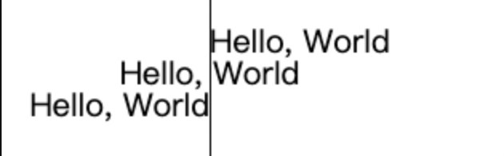
- `direction`
  - 用来指定文字的绘制方向. 上面的 `textAlign` 并没有演示 `start` 和 `end` 的情况
  - 可以取值 `ltr`, `rtl` 和 `inherit`. 默认是 `inherit`
  - ```js
    function testDirection() {
      context.font = '20px PingFang';
      
      context.direction = 'lrt'
      context.textAlign = 'start'
      context.fillText('Hello, World', 130, 100)
      context.textAlign = 'end'
      context.fillText('Hello, World', 130, 120)

      context.direction = 'rtl'
      context.textAlign = 'start'
      context.fillText('Hello, World', 130, 140)
      context.textAlign = 'end'
      context.fillText('Hello, World', 130, 160)
    }
  - 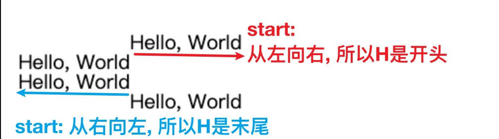
- `textBaseline`
  - 指定绘制文字的基线(`baseline`)
  - 取值
    - `top`: 基线是 `em` 盒子的顶部
    - `handing`: 基线是悬挂基线(`hanging baseline`), 藏文和其他印度文字使用
    - `middle`: 基线是 `em` 盒子正中间
    - `alphabetic`: 基线是正常字母基线. 默认值
    - `ideographic`: 基线是表意基线. 如果字符的主体突出到字母基线(`alphabetic baseline`) 的下方, 那么字符的底部就是表意基线. 中文、日文和韩文使用
    - `bottom`: `bounding box` 的底边. 与表意基线不同的是表意基线不考虑 `descender`. 什么是 `descender` 呢? 比如小写字母 `p`, 其一部分在整个字母主体的下方, 所以在下方的就叫做 `descender`.
  - 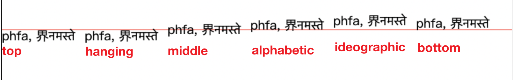
  - 下图是 `MDN` 中关于不同文字边界的介绍.
  - 
### 高级文字测量
如果你想获得关于文本的更多细节, 可以使用 `measureText()`
### 可访问性
```js 
```
```html
```


谢谢你看到这里😊


