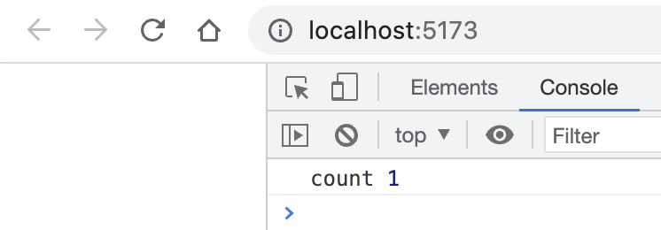
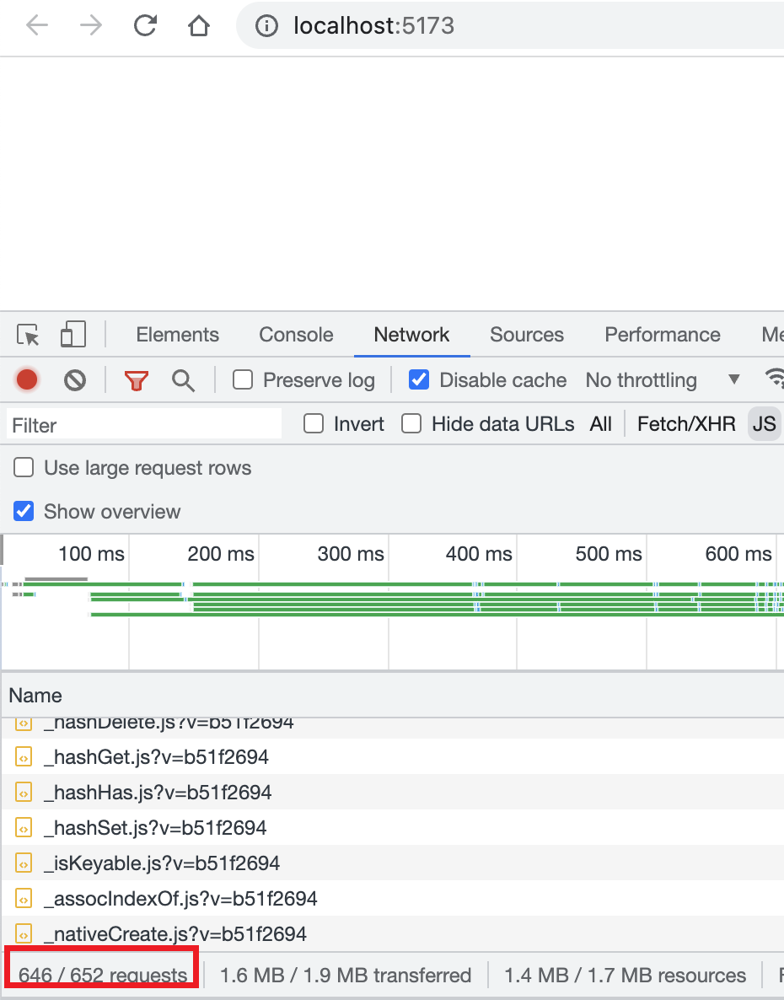
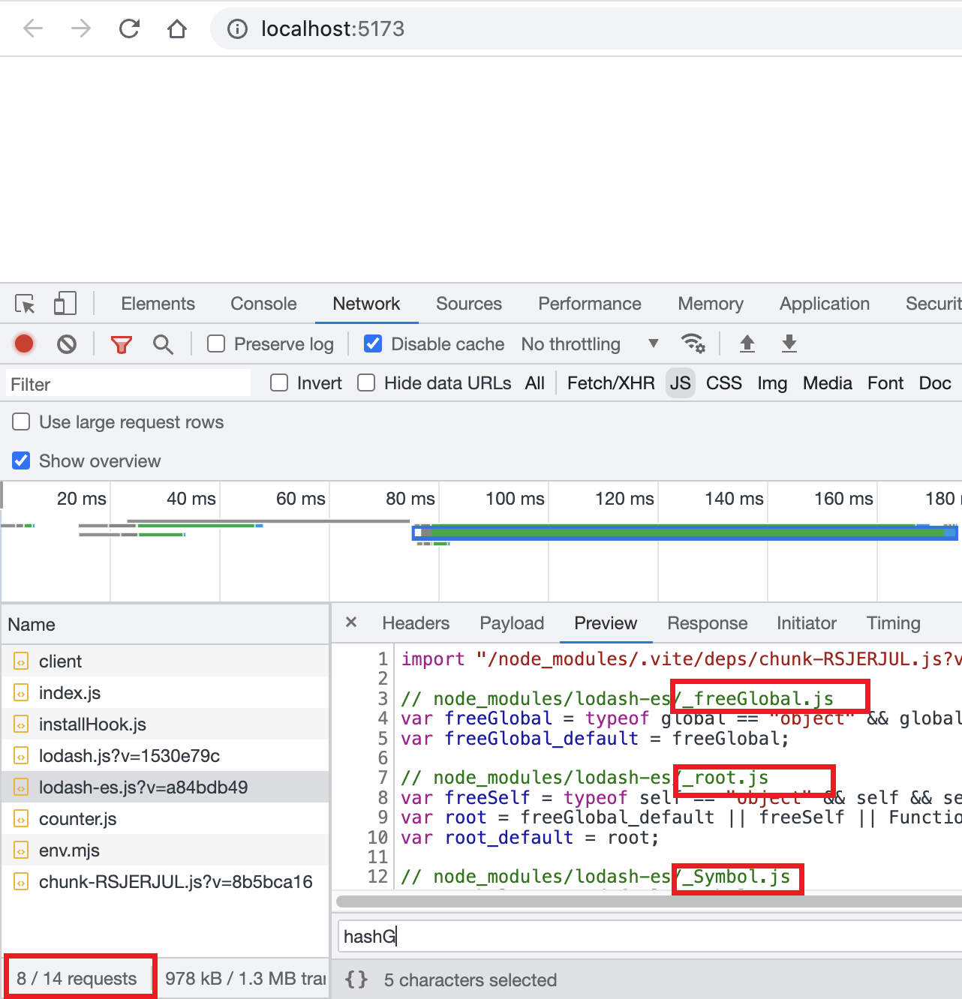
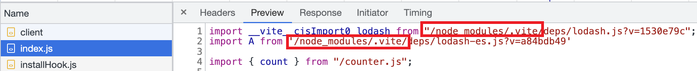

# [Vite](https://vitejs.dev/): 下一代的前端工具链

## 基本知识
`Vite` 主要由两部分组成
1. 一个开发服务器, `它给予原生` `ES` 模块提供了丰富的内建功能.
2. 一套构建指令, 它使用 `Rollup` 打包代码并且是预配置的, 可输出用于生产环境高度优化过的静态资源.

### Hello, World
创建 `index.html`
```html
<body>
  <script type="module" src="./index.js"></script>
</body>
```
`index.js`
```js
import { count } from "./counter.js";
console.log('count',count)
```
`counter.js`
```js
export const count = 1
```
使用 `yarn init -y` 初始化当前项目, 然后 `yarn add vite -D` 安装开发依赖.

在 `package.json` 中增加启动脚本, 执行 `yarn dev`
```json
"scripts": {
  "dev": "vite"
},
```


## Vite 的预构建
`Vite` 尽在开发环境下进行预构建.

预构建的使用场景.
- 将非 `ES module` 规范的代码转为符合 ES module;
- 将有许多内部模块的 `ESM` 依赖关系转换为单个模块, 从而减少 `http` 请求数量

1. 情况二
我们来看第二种情况. `lodash-es` 是 `lodash` 的以 `es` 模块导出的库. 为了演示这种情况需要先将 `Vite` 对 `lodash-es` 的预构建关闭, 具体可以看[这个配置 optimizeDeps.exclude](https://cn.vitejs.dev/config/dep-optimization-options.html#optimizedeps-exclude). 当然需要现在跟目录创建 `vite.config.js` 的配置文件

```js
import { defineConfig } from 'vite'

export default defineConfig({
  optimizeDeps: {
    exclude: ['lodash-es'],
  },
})
```
并在 `index.js` 中引入 `lodash-es`
```js
import _ from 'lodash'
import A from 'lodash-es'
```
之后, 运行项目可以看到打开网页时发出了几百个请求



如果我们开启预构建呢? 那只有一个关于 `lodash-es` 的请求了, 那原本请求的 `JS` 文件呢? `Vite` 都帮我们合并了!



接下来, 看下 Vite 是如何做到这一点的? 看下原本的 `lodash-es/index.d.ts` 的内容
```js
export { default as add } from './add.js';
export { default as after } from './after.js';
export { default as ary } from './ary.js';
```
都是这种导入之后又导出的语法, 那 Vite 就从其中做了拦截, 只导入, 删除导出语句

2. 情况一
第一种情况, 我们知道 `lodash` 是使用 `commonJS` 语法导出
```js
module.exports = require('./lodash');
```
但是在 `index.js` 中我们是使用 `ES module` 的语法导入 `lodash` 的
```js
import _ from 'lodash'
// 而不是
// const _ = require('lodash')
```
在开发阶段, `Vite` 的开发服务器将所有代码都视为 `ES module`. 因此, `Vite` 必须将 `commonJS` 等其他规范的依赖转为 `ES module`.

官网是这么说的, 当转换 `commonJS` 依赖时, `Vite` 会执行职能导入分析. 那么转换之后的情况是什么样子呢?
```js
import __vite__cjsImport0_lodash from "/node_modules/.vite/deps/lodash.js?v=1530e79c";

const _ = __vite__cjsImport0_lodash.__esModule ? __vite__cjsImport0_lodash.default : __vite__cjsImport0_lodash
```
### 缓存
还有一点, 如下图, 预构建之后的依赖被放在 `node_modules/.vite` 文件夹下, 在 `index.js` 中引入的文件也变成了引入预构建后的文件



如果我们想要强制 `Vite` 重新构建依赖, 可以使用 `--force` 选项重启开发服务器, 或者手动删除 `node_modules/.vite` 文件夹.


谢谢你看到这里😊